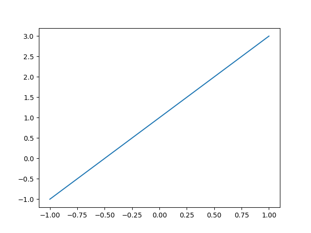
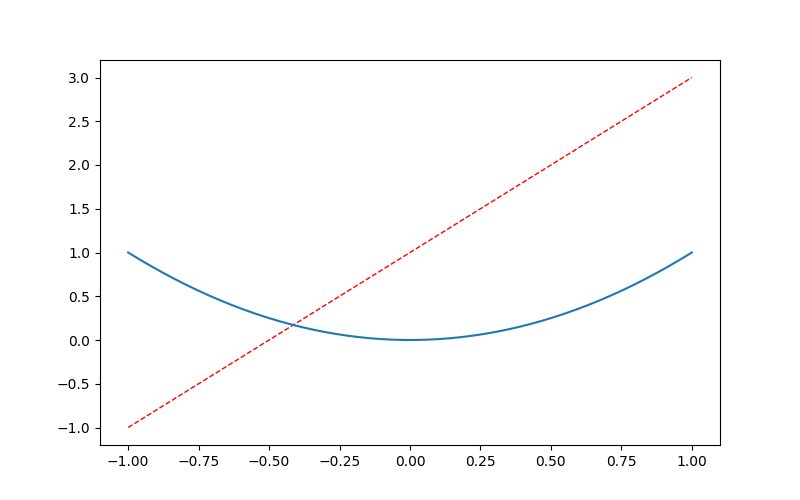
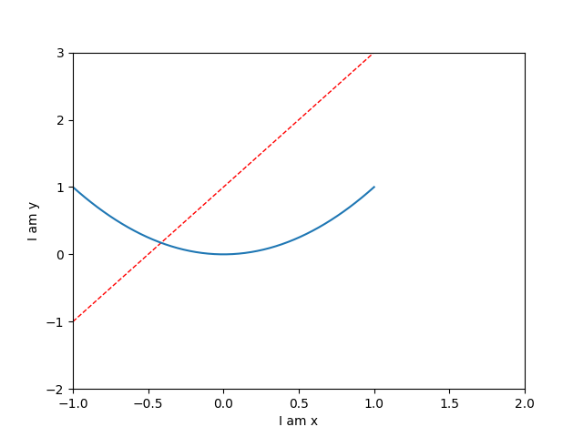
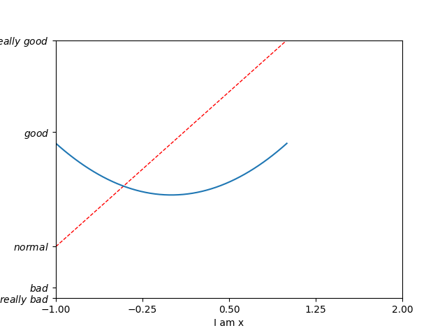
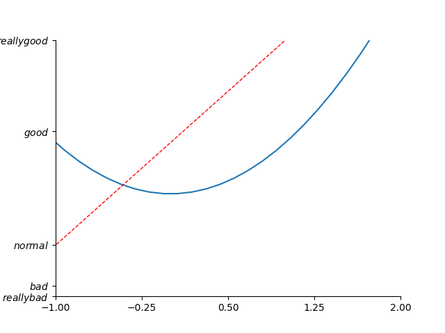
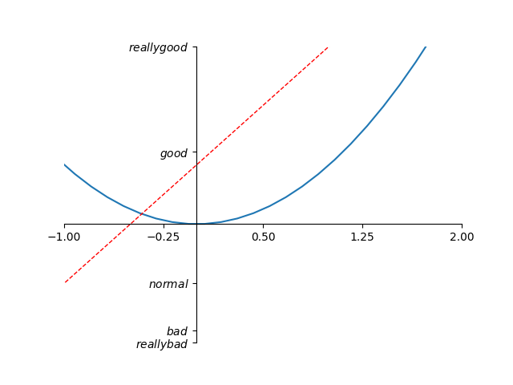
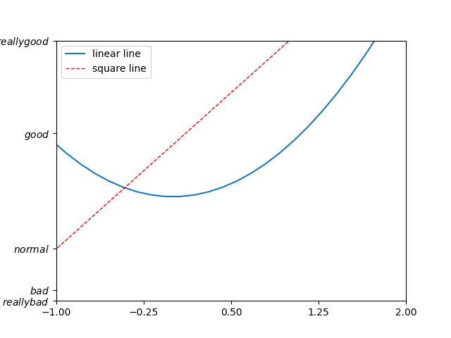
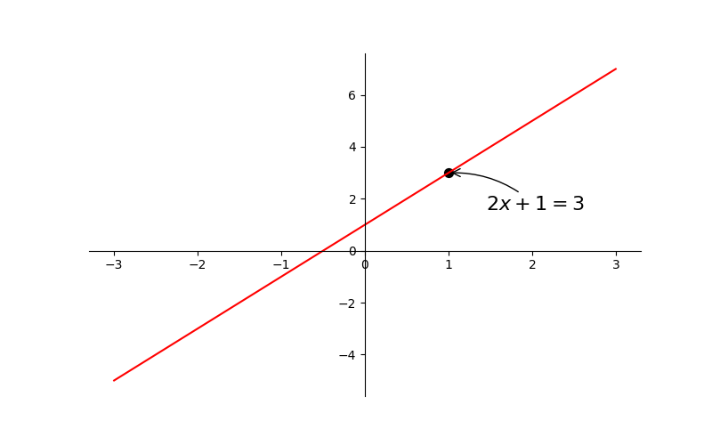
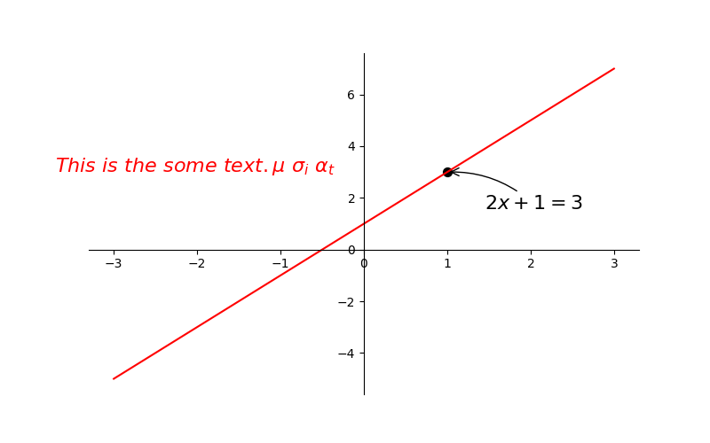
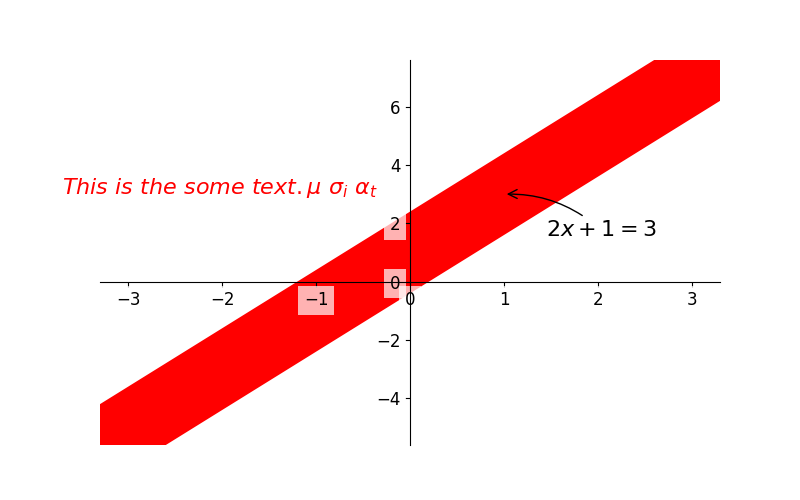

[toc]

# 基本使用

## 1. 基本用法

使用 `import` 导入模块 `matplotlib.pyplot`，并简写成 `plt` 。使用 `import` 导入模块 `numpy`，并简写成 `np`。

```python
import numpy as np
import matplotlib.pyplot as plt
```

使用 `np.linspace` 定义 $x$：范围是 $(-1,1)$，个数是 $50$。用于仿真一维数据组 $(x, y)$ 表示曲线 1。

```python
x = np.linspace(-1, 1, 50)
y = 2 * x + 1
```

使用 `plt.figure` 定义一个图像窗口，`plt.plot` 绘制 $(x, y)$ 曲线，使用 `plt.show` 显示图像。

```python
plt.figure()  # 定义一个窗口
plt.plot(x, y)
plt.show()
```



## 2. figure 图像

matplotlib 的 figure 就是一个单独的 figure 小窗口，小窗口里面还可以有更多的小图片。

```python
x = np.linspace(-1, 1, 50)
y1 = 2 * x + 1
y2 = x ** 2
```

使用 `plt.figure` 定义一个图像窗口，`plt.plot` 绘制 $(x, y1)$ 曲线。

```python
plt.figure()  # 定义一个窗口
plt.plot(x, y1)
```


使用 `plt.figure` 定义一个图像窗口：编号为 3，大小为 $(8, 5)$。使用 `plt.plot` 画 $(x, y2)$ 曲线。使用 `plt.plot` 画 $(x ,y1)$ 曲线，曲线的颜色属性（`color`）为红色，曲线的宽度（`linewidth`）为 1.0，曲线的类型（`linestyle`）为虚线。使用 `plt.show` 显示图像。

```python
plt.figure(num=3, figsize=(8, 5))
plt.plot(x, y1, color='red', linewidth=1.0, linestyle='--')
plt.plot(x, y2)
plt.show()
```



## 3. axis 设置

### 3.1 调整名字和间隔 

使用 `plt.xlim` 和 `plt.ylim` 分别设置 x 坐标轴范围和 y 坐标轴范围为 $(-1, 2)$ 和 $(-2, 3)$；使用 `plt.xlabel` 和 `plt.ylabel` 分别设置 x 坐标轴名称和 y 坐标轴名称为 `I am x` 和  `I am y`。

```python
plt.figure(num=3, figsize=(8, 5))
plt.xlim((-1, 2))
plt.ylim((-2, 3))
plt.xlabel('I am x')
plt.ylabel('I am y')
plt.plot(x, y1, color='red', linewidth=1.0, linestyle='--')
plt.plot(x, y2)
plt.show()
```



使用 `np.linspace` 定义范围以及个数，范围是 $(-1,2)$，个数是 5。使用 `plt.xticks` 设置 x 轴刻度，范围是 $(-1,2)$，个数是 5。

```python
new_ticks = np.linspace(-1, 2, 5)
print(new_ticks)
plt.xticks(new_ticks)
```

使用 `plt.yticks` 设置 y 轴刻度以及名称，刻度为 $[-2, -1.8, -1, 1.22, 3]$，对应刻度的名称为 $['really bad','bad','normal','good', 'really good']$。

```python
plt.figure()
plt.xticks(new_ticks)
plt.yticks([-2, -1.8, -1, 1.22, 3],
           [r'$really\ bad$', r'$bad$', r'$normal$', r'$good$', r'$really\ good$'])
plt.plot(x, y1, color='red', linewidth=1.0, linestyle='--')
plt.plot(x, y2)
plt.show()
```



使用 `plt.gca` （get current axis）获取当前坐标轴信息。

使用 `.spines` 设置右侧和上侧边框，使用 `.set_color` 设置边框颜色为白色（默认白色）。

```python
ax = plt.gca()
ax.spines['right'].set_color('none')
ax.spines['top'].set_color('none')
plt.show()
```



### 3.2 移动 axis 坐标轴的位置

使用 `.xaxis.set_ticks_position` 设置 x 坐标刻度数字或名称的位置为 `bottom`，使用`.yaxis.set_ticks_position`设置 y 坐标刻度数字或名称的位置为 `left`。（所有位置：`top`，`bottom`，`left`，`right`，`both`，`default`，`none`）

使用 `.spines` 设置边框，使用 `.set_position` 设置边框的位置。将 x 轴边框位置设置为 y = 0 的位置，将 y 轴边框位置设置为 x = 0 的位置。（位置所有属性：`outward`，`axes`，`data`）

```python
ax = plt.gca()
ax.spines['right'].set_color('none')
ax.spines['top'].set_color('none')
ax.xaxis.set_ticks_position('bottom')
ax.yaxis.set_ticks_position('left')
ax.spines['bottom'].set_position(('data', 0))
ax.spines['left'].set_position(('data', 0))
plt.show()
```



## 4. legend 图例

matplotlib 中的 `legend` 图例是为了帮我们展示出每个数据对应的图像名称，更好的认识到所使用的数据结构。

`legend` 将要显示的信息来自于代码中的 `label`。所以只需要简单写下一下代码，plt 就能自动的为我们添加图例。

```python
plt.plot(x, y2, label="linear line")
plt.plot(x, y1, label="square line", color='red', linewidth=1.0, linestyle='--')

# legend 图例
plt.legend()
plt.show()
```



如果想单独修改之前的 `label` 信息，给不同类型的线条设置图例信息，我们可以在 `plt.legend` 中输入更多参数。如果以下面这种形式添加 legend，我们需要确保在上面的代码 `plt.plot(x, y2, label='linear line')` 和 `plt.plot(x, y1, label='square line')` 中有用变量 `l1` 和 `l2` 分别存储起来。而且需要注意的是 `l1,` `l2,` 要以逗号结尾，因为`plt.plot()` 返回的是一个列表。

```python
line1, = plt.plot(x, y2, label="linear line")
line2, = plt.plot(x, y1, label="square line", color='red', linewidth=1.0, linestyle='--')

# legend 图例
plt.legend(handles=[line1, line2], labels=['linear line', 'square line'],  loc='best')
plt.show()
```


其中 `oc` 参数有多种，`best` 表示自动分配最佳位置，其余的如下：

```python
 'best' : 0,          
 'upper right'  : 1,
 'upper left'   : 2,
 'lower left'   : 3,
 'lower right'  : 4,
 'right'        : 5,
 'center left'  : 6,
 'center right' : 7,
 'lower center' : 8,
 'upper center' : 9,
 'center'       : 10,
```

## 5. Annotation 标注

当图线中某些特殊地方需要标注时，我们可以使用 `annotation`。matplotlib 中的 `annotation` 有两种方法， 一种是用 plt 里面的 `annotate`，一种是直接用 plt 里面的 `text` 来写标注。

```
import numpy as np
import matplotlib.pyplot as plt

x = np.linspace(-3, 3, 50)
y = 2*x + 1

plt.figure(num=1, figsize=(8, 5))

ax = plt.gca()

ax.spines['right'].set_color('none')
ax.spines['top'].set_color('none')

ax.xaxis.set_ticks_position('bottom')
ax.spines['bottom'].set_position(('data', 0))
ax.yaxis.set_ticks_position('left')
ax.spines['left'].set_position(('data', 0))

# 标注一个点
x0 = 1
y0 = 2 * x0 + 1
# set dot styles
plt.scatter([x0, ], [y0, ], s=50, color='k')

plt.plot(x, y, c='r')

# 添加标注
plt.annotate(r'$2x+1=%s$' % y0, xy=(x0, y0), xycoords='data', xytext=(+30, -30),
             textcoords='offset points', fontsize=16,
             arrowprops=dict(arrowstyle='->', connectionstyle="arc3,rad=.2"))

plt.show()
```



添加 `text`。

```python
plt.text(-3.7, 3, r'$This\ is\ the\ some\ text. \mu\ \sigma_i\ \alpha_t$',
         fontdict={'size': 16, 'color': 'r'})
```



## 6. **tick 能见度**

当图片中的内容较多，相互遮盖时，我们可以通过设置相关内容的透明度来使图片更易于观察，也即是通过本节中的 `bbox` 参数设置来调节图像信息。

```python
for label in ax.get_xticklabels() + ax.get_yticklabels():
    label.set_fontsize(12)
    # 在 plt 2.0.2 或更高的版本中, 设置 zorder 给 plot 在 z 轴方向排序
    label.set_bbox(dict(facecolor='white', edgecolor='None', alpha=0.7, zorder=2))  # plot 也需要设置 zorder
plt.show()
```

其中 `label.set_fontsize(12)` 重新调节字体大小，`bbox` 设置目的内容的透明度相关参，`facecolor `调节 `box` 前景色，`edgecolor` 设置边框，本处设置边框为无，`alpha` 设置透明度。最终结果如下:


