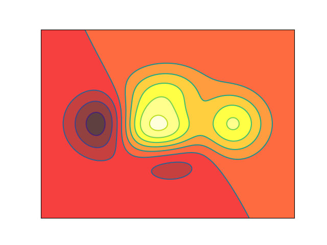

[toc]

# 图形类别

## Plot 折线图

`plot()` 可以用来绘制折线图，通过参数指定折线图上端点的位置、标记符号的形状、大小和颜色以及线条的颜色、线型等样式，然后使用指定的样式把给定的点依次进行连接，最终得到折线图。如果给定的点足够密集，可以形成光滑曲线的效果。该函数的语法格式如下：

```python
plot(*args, **kwargs)
```

| args 参数      | 描述                                                         |
| -------------- | ------------------------------------------------------------ |
| 第一个参数     | 指定折线图上一个或多个端点的 x 坐标。                        |
| 第二个参数     | 指定折线图上一个或多个端点的 y 坐标。                        |
| 第三个位置参数 | 用来同时指定折线图的颜色、线型和标记符号形状（也可以通过关键参数 kwargs 指定）。 |

| 第三个位置参数 | 描述                                                         |
| -------------- | ------------------------------------------------------------ |
| 颜色           | 取值为 `r(红色)、g(绿色)、b(蓝色)、c(青色)、m(品红色)、y(黄色)、k(黑色)、w(白色)`。 |
| 线型           | 常用取值有 `-(实心线)、--(短划线)、-.(点划线) 和 :(点线)`。  |
| 标记符号       | 取值有 `.(圆点)、o(圆圈)、v(向下的三角形)、^(向上的三角形)、<(向左的三角形)、>(向右的三角形)、*(五角星)、+(加号)、_(下画线)、x(x符号)、D(菱形)`。 |

例如，`plot(x, y, 'r-+')` 使用等长数组 x 和 y 中对应元素作为端点坐标绘制红色实心线并使用加号标记端点，而 `plot(x, y, 'g--v)` 会绘制绿色短划线并以下三角标记端点；而 `plot(x, y, '+')` 只会以加号标记端点却不绘制线条。

**kwargs** 用来设置标签、线宽、反走样以及标记符号的大小、边线颜色、边线宽度与背景色等属性。

| kwargs 参数            | 描述                                                         |
| ---------------------- | ------------------------------------------------------------ |
| **alpha**              | 指定透明度，介于 0 到 1 之间。默认为 1，表示完全不透明。     |
| antialiased 或 aa      | True 表示图形启用抗锯齿或反走样，False 表示不启用抗锯齿。默认为 True。 |
| **color 或 c**         | 指定线条颜色。可以取上述的颜色值或 `#rrggbb` 形式的颜色值。例如 `#ff0000` 表示红色。 |
| **label**              | 指定线条标签，设置之后会显示在图例中。                       |
| **linestyle 或 Is**    | 指定线型。                                                   |
| **linewidth 或 lw**    | 指定线条宽度，单位为像素。                                   |
| marker                 | 指定标记符号的形状。                                         |
| markeredgecolor 或 mec | 指定标记符号的边线颜色。                                     |
| markeredgewidth 或 mew | 指定标记符号的边线宽度。                                     |
| markerfacecolor 或 mfc | 指定标记符号的背景颜色。                                     |
| markersize 或 ms       | 指定标记符号的大小。                                         |
| visible                | 指定线条和标记符号是否可见。默认为 True。                    |

## Scatter 散点图

`scatter()` 可以根据给定的数据绘制散点图，语法格式如下：

```python
scatter(x, y, s=None, c=None, marker=None, cmap=None, norm=None, vmin=None, vmax=None, aplha=None, linewidths=None, verts=None, edgecolors=None, hold=None, data=None, **kwargs)
```

| 参数       | 描述                                                         |
| ---------- | ------------------------------------------------------------ |
| s          | 指定散点符号的大小。                                         |
| marker     | 指定散点符号的形状。                                         |
| linewidths | 指定线宽，可以是标量或类似于数组的对象。                     |
| edgecolors | 指定散点符号的边线颜色，可以是颜色值或包含若干颜色值的序列。 |

```python
import numpy as np
import matplotlib.pyplot as plt

n = 1024    # data size
X = np.random.normal(0, 1, n)  # 每一个点的 X 值
Y = np.random.normal(0, 1, n)  # 每一个点的 Y 值
T = np.arctan2(Y,X)  # for color value

plt.scatter(X, Y, c=T, alpha=0.5)

plt.xlim(-1.5, 1.5)
plt.ylim(-1.5, 1.5)

plt.show()
```


## Bar 柱状图

`bar()` 可以用来根据给定的数据绘制柱状图。柱状图适合用来比较多组数据之间的大小，或者类似的场合，但对大规模数据的可视化不是很适合。

```python
bar(left, height, width=0.8, bottom=None, hold=None, data=None, **kwargs)
```

[matplotlib.pyplot.bar — Matplotlib 3.9.2 documentation](https://matplotlib.org/stable/api/_as_gen/matplotlib.pyplot.bar.html)

```python
import matplotlib.pyplot as plt
import numpy as np

n = 12
X = np.arange(n)
Y1 = (1 - X / float(n)) * np.random.uniform(0.5, 1.0, n)
Y2 = (1 - X / float(n)) * np.random.uniform(0.5, 1.0, n)

plt.bar(X, +Y1, facecolor='#9999ff', edgecolor='white')
plt.bar(X, -Y2, facecolor='#ff9999', edgecolor='white')

plt.xlim(-.5, n)
plt.xticks(())
plt.ylim(-1.25, 1.25)
plt.yticks(())

for x, y in zip(X, Y1):
    # ha: horizontal alignment
    # va: vertical alignment
    plt.text(x, y + 0.05, '%.2f' % y, ha='center', va='bottom')

for x, y in zip(X, Y2):
    # ha: horizontal alignment
    # va: vertical alignment
    plt.text(x, -y - 0.05, '%.2f' % y, ha='center', va='top')

plt.show()
```


## Contours 等高线图

[matplotlib.pyplot.contour — Matplotlib 3.9.2 documentation](https://matplotlib.org/stable/api/_as_gen/matplotlib.pyplot.contour.html)

数据集即为三维点 $(x,y)$ 和对应的高度值 $z$，共有 256 个点。高度值使用一个 `f(x,y)` 生成。x，y 分别是在区间 $[-3,3]$ 中均匀分布的 256 个值，并用 `meshgrid` 在二维平面中将每一个 x 和每一个 y 分别对应起来，编织成栅格。

接下来进行颜色填充。使用函数 `plt.contourf` 把颜色加进去，位置参数分别为 X，Y，$f(X,Y)$。透明度 0.75，并将 $f(X,Y)$ 的值对应到 color map 的暖色组中寻找对应颜色。

接下来进行等高线绘制。使用 `plt.contour` 函数划线。位置参数为 X，Y，$f(X,Y)$。颜色选黑色，线条宽度选 0.5。其中，8 代表等高线的密集程度，这里被分为 10 个部分。如果是 0，则图像被一分为二。

最后加入 Label，`inline` 控制是否将 Label 画在线里面，字体大小为 10，并将坐标轴隐藏。

```python
import numpy as np
import matplotlib.pyplot as plt

# 生成高度
def f(x, y):
    return (1 - x / 2 + x ** 5 + y ** 3) * np.exp(-x ** 2 - y ** 2)


n = 256
x = np.linspace(-3, 3, n)
y = np.linspace(-3, 3, n)

X, Y = np.meshgrid(x, y)  # 从两个给定的一维数组中创建一个矩形网格, 返回两个二维数组，代表所有点的 X 和 Y 坐标。

plt.contourf(X, Y, f(X, Y), 8, alpha=0.75, cmap=plt.cm.hot)  # 填充颜色

C = plt.contour(X, Y, f(X, Y), 8, color='black', linewidth=0.5)  # 绘制等高线

plt.clabel(C, inline=True, fontsize=10)  # 添加标签

plt.xticks(())
plt.yticks(())
```



## Image 图片

[Interpolations for imshow — Matplotlib 3.9.2 documentation](https://matplotlib.org/stable/gallery/images_contours_and_fields/interpolation_methods.html#sphx-glr-gallery-images-contours-and-fields-interpolation-methods-py)

之前选 cmap 的参数时用的是 `cmap=plt.cmap.bone`，而现在，我们可以直接用单引号传入参数。 `origin='lower'` 代表的就是选择的原点的位置。

`colorbar` 会显示颜色栏，其中 `shrink` 参数使 `colorbar` 的长度变短为原来的 92%。

```python
import numpy as np
import matplotlib.pyplot as plt

a = np.array([0.313660827978, 0.365348418405, 0.423733120134,
              0.365348418405, 0.439599930621, 0.525083754405,
              0.423733120134, 0.525083754405, 0.651536351379]).reshape(3,3)

plt.imshow(a, interpolation='nearest', cmap='bone', origin='upper')

plt.colorbar(shrink=.92)

plt.show()
```


## 3D 图

首先在进行 `3D Plot` 时除了导入 `matplotlib`，还要额外添加一个模块 `Axes 3D` 用于 3D 坐标轴显示。

```python
import numpy as np
import matplotlib.pyplot as plt
import matplotlib.cm as cm
from mpl_toolkits.mplot3d import Axes3D
```

先定义一个图像窗口，在窗口上添加 3D 坐标轴。

```python
# set up a figure twice as wide as it is tall
fig = plt.figure(figsize=plt.figaspect(0.5))

# set up the axes for the first plot
ax = fig.add_subplot(1, 2, 1, projection='3d')
```

接下来给进 X 和 Y 值，并将 X 和 Y 编织成栅格。每一个（X, Y）点对应的高度值我们用下面这个函数来计算。

```python
# plot a 3D surface like in the example mplot3d/surface3d_demo
X = np.arange(-5, 5, 0.25)
Y = np.arange(-5, 5, 0.25)
X, Y = np.meshgrid(X, Y)
R = np.sqrt(X**2 + Y**2)   # x-y 平面的网格
Z = np.sin(R)  # # height value
```

做出一个三维曲面，并将一个 `colormap rainbow` 填充颜色，之后将三维图像投影到 XY 平面上做一个等高线图。

```python
surf = ax.plot_surface(X, Y, Z, rstride=1, cstride=1, cmap=cm.coolwarm,
                       linewidth=0, antialiased=False)
```

其中，`rstride` 和 `cstride` 分别代表 row 和 column 的跨度。

```python
ax.set_zlim(-1.01, 1.01)
fig.colorbar(surf, shrink=0.5, aspect=10)

plt.show()
```
