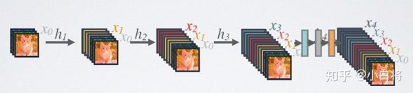
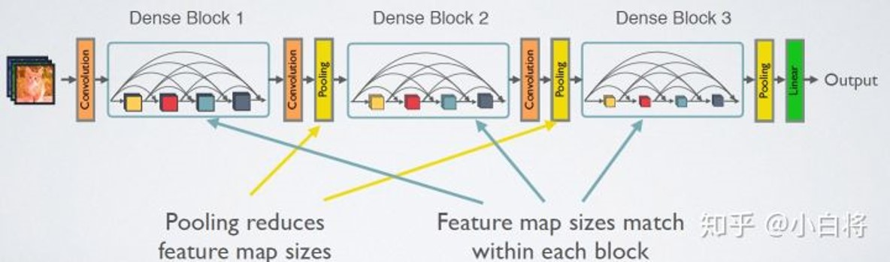

[toc]

# 稠密连接网络

##  1. DenseNet 与 ResNet 对比

- ResNet（深度残差网络，Deep residual network，ResNet）：通过建立前面层与后面层之间的“短路连接”，这有助于训练过程中梯度的反向传播，从而能训练出更深的 CNN 网络。
- DenseNet：采用密集连接机制，某层的输入除了包含前一层的输出外还包含前面所有层的输出，因此 L 层的模型会有 L(L - 1) / 2 个连接。即互相连接所有的层，每个层都会与前面所有层在 Channel 维度上连接（concat）在一起，实现特征重用，作为下一层的输入。

这样，不但减缓了梯度消失的现象，也使其可以在参数与计算量更少的情况下实现比 ResNet 更优的性能。

## 2. DenseNet 的公式表示

传统的网络在 $l$ 层的输出为：$x_l=H_l(x_{l-1})$

对于 ResNet，增加了来自上一层的输入：$x_l=H_l(x_{l-1}) + x_{l-1}$

在 DenseNet 中，会连接前面所有层作为输入：$x_l=H_l([x_0,x_1,\dots,x_{l-1}])$

$H_l(·)$ 代表是非线性转化函数。它是一个组合操作，其可能包括一系列的 BN（Batch Normalization），ReLU，Pooling 及 Conv 操作。

特征传递方式是直接将前面所有层的特征连接（concat）后传到下一层，而不是前面层都要有一个箭头指向后面的所有层。

## 3. DenseNet 的网络结构

整个 DenseNet 模型主要包含三个核心细节结构。分别是 DenseLayer（整个模型最基础的原子单元，完成一次最基础的特征提取）、DenseBlock（整个模型密集连接的基础单元）和 Transition（不同密集连接之间的过渡单元），通过以上结构的拼接 + 分类层即可完成整个模型的搭建。

DenseNet 的密集连接方式需要特征图大小保持一致。所以 DenseNet 网络中使用 DenseBlock + Transition 的结构。

DenseBlock 是包含很多层（DenseLayer）的模块，每个层的特征图大小相同，层与层之间采用密集连接方式。

Transition 模块是连接两个相邻的 DenseBlock，并且通过 Pooling 使特征图大小降低。

### 3.1 DenseBlock

在 DenseBlock 中，各个层（DenseLayer）的特征图大小一致，可以在 Channel 维度上连接。DenseBlock 中的非线性组合函数  $H_l(\cdot)$  采用的是 **BN + ReLU + 3 × 3 Conv** 的结构。

假定输入层的特征图的 Channel 数为 $k_0$，DenseBlock 中各个层卷积之后均输出 $k$ 个特征图，即得到的特征图的 Channel 数为 $k$，那么 $l$ 层输入的 Channel 数为 $k_0+(l−1)k$。我们将 $k$ 称之为网络的增长率（Growth Rate）。

因为每一层都接受前面所有层的特征图，即特征传递方式是直接将前面所有层的特征连接（concat）后传到下一层。因此一般情况下使用较小的 $k$（比如 12），要注意这个 $k$ 的实际含义就是这层新提取出的特征。

Dense Block 采用了激活函数在前、卷积层在后的顺序，即 BN-ReLU-Conv 的顺序。这种方式也被称为 Pre-Activation。通常的模型 ReLU 等激活函数处于卷积 Conv、批归一化 Batch-Norm 之后，即 Conv-BN-ReLU，也被称为 Post-Activation。作者证明，如果采用 Post-Activation 设计，性能会变差。

### 3.2 Bottleneck

由于后面层的输入会非常大，DenseBlock 内部可以采用 Bottleneck 层来减少计算量，主要是原有的结构中增加 1x1 Conv，即 **BN + ReLU + 1×1 Conv + BN + ReLU + 3×3 Conv**。称为 DenseNet-B 结构。

其中 1×1 Conv 得到 $4k$ 个特征图。它起到的作用是降低特征数量，从而提升计算效率。

每一个 Bottleneck 输出的特征通道数是相同的。

这里 1×1 卷积的作用是固定输出通道数，达到降维的作用。1×1 卷积输出的通道数通常是 Growth Rate（$k$） 的 4 倍。当几十个 Bottleneck 相连接时，连接（concat）后的通道数会增加到上千。如果不增加 1×1 的卷积来降维，后续 3×3 卷积所需的参数量会急剧增加。

比如，输入通道数 64，增长率 $k$ = 32，经过 15 个 Bottleneck，通道数输出为 64 + 15 \* 32 = 544，。如果不使用 1×1 卷积，第 16 个 Bottleneck 层参数量是 3 \* 3 \* 544 \* 32 = 156672；如果使用 1×1 卷积，第 16 个 Bottleneck 层参数量是 1 \* 1 \* 544 \* 128 + 3 \* 3 \* 128 \* 32 = 106496，可以看到参数量大大降低。

### 3.3 Transition 层

它主要是连接两个相邻的 DenseBlock，并且降低特征图大小。Transition 层包括一个 1×1 的卷积和 2×2 的 AvgPooling。1 \* 1 Conv 负责降低通道数，2 \* 2 AvgPooling 负责降低特征层宽度，降低到 1 / 2。结构为：**BN + ReLU + 1×1 Conv + 2×2 AvgPooling**。

Transition 层可以起到压缩模型的作用。

假定 Transition 的上接 DenseBlock 得到的特征图 channels 数为 m，Transition 层可以产生  $\lfloor \theta m \rfloor$ 个特征（通过卷积层），其中 $\theta \subset [0,1]$ 是压缩系数（Compression Rate）。

当 $\theta$ = 1 时，特征个数经过 Transition 层没有变化，即无压缩。而当 $\theta$ < 1 时，这种结构称为 DenseNet-C。

一般使用 $\theta$ = 0.5。对于使用 Bottleneck 层的 DenseBlock 结构和 $\theta$ < 1 的 Transition 组合结构称为 DenseNet-BC。

## 4. DenseNet 的网络框架

## 5. 一些实验结果及讨论

DenseNet 在 CIFAR-100 和 ImageNet 数据集上与 ResNet 的对比结果。

从图中可以看到，只有 0.8M 的 DenseNet-100 性能已经超越 ResNet-1001，并且后者参数大小为 10.2M。而从图中可以看出，同等参数大小时，DenseNet 也优于 ResNet 网络。

## 6. DenseNet 的优势

### 6.1 更强的梯度流动

由于密集连接方式，DenseNet 提升了梯度的反向传播，使得网络更容易训练。

由于每层可以直达最后的误差信号，实现了隐式的 “deep supervision”。误差信号可以很容易地传播到较早的层，所以较早的层可以从最终分类层获得直接监管（监督）。

### 6.2 减轻了 Vanishing-Gradient（梯度消失）

过梯度消失问题在网络深度越深的时候越容易出现，原因就是输入信息和梯度信息在很多层之间传递导致的。

而现在这种 Dense Connection 相当于每一层都直接连接 Input 和 Loss，因此就可以减轻梯度消失现象，这样更深网络不是问题。

### 6.3 减少了参数数量

### 6.4 保存了低维度的特征

在标准的卷积网络中，最终输出只会利用提取最高层次的特征。

而在 DenseNet 中，它使用了不同层次的特征，倾向于给出更平滑的决策边界。这也解释了为什么训练数据不足时 DenseNet 表现依旧良好。

## 7. DenseNet 的不足

DenseNet 的不足在于由于需要进行多次 Concatnate 操作，数据需要被复制多次，显存容易增加得很快，需要一定的显存优化技术。

另外，DenseNet 是一种更为特殊的网络，ResNet 则相对一般化一些，因此 ResNet 的应用范围更广泛。