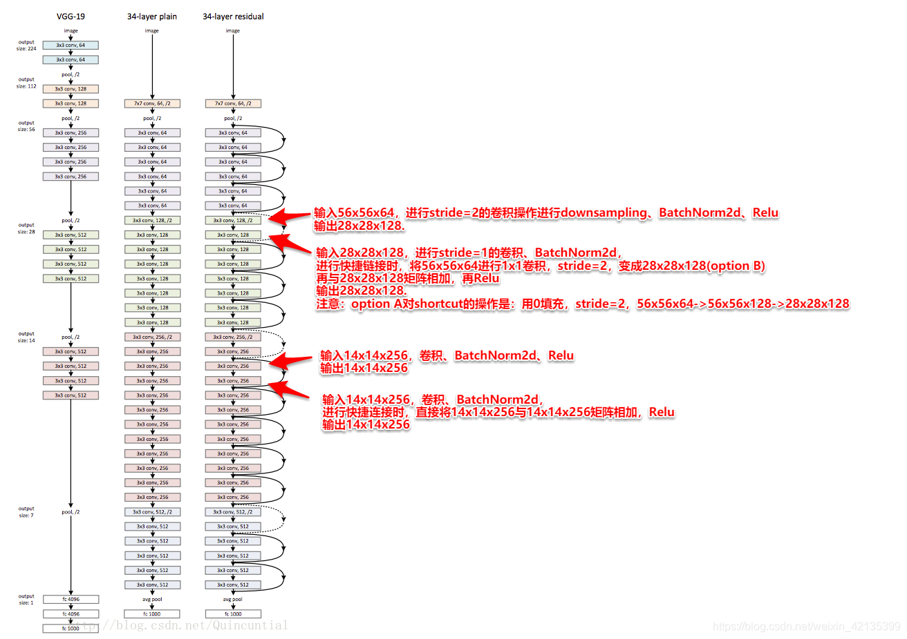
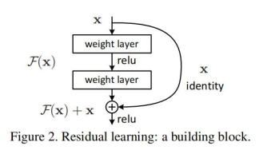
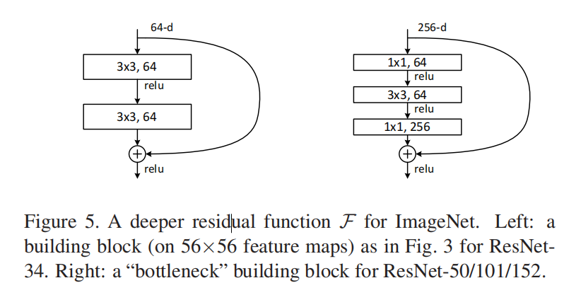
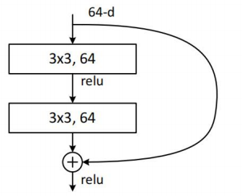
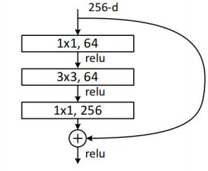
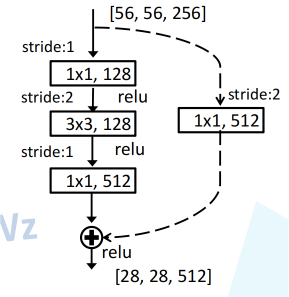
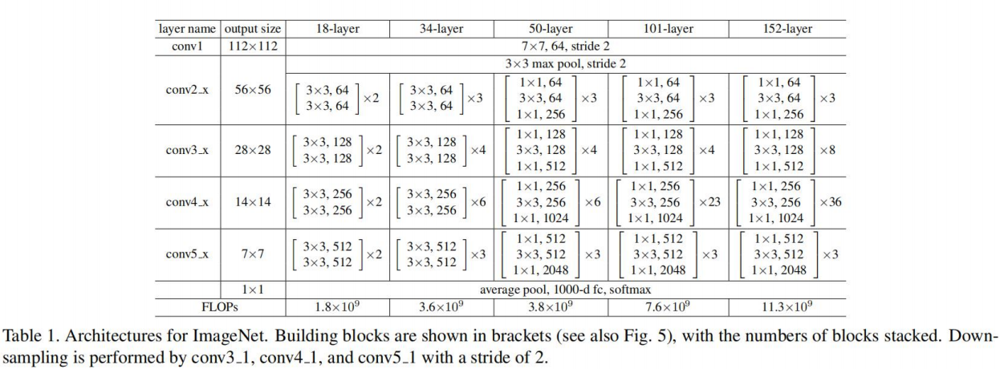

[toc]

# ResNet

ResNet 在 2015 年由微软实验室提出，斩获当年 ImageNet 竞赛中：分类任务第一名，目标检测第一名。获得 COCO 数据集中目标检测第一名，图像分割第一名。

## ResNet 的亮点

“Deeper neural networks are more difficult to train.” (He 等, 2016, p. 1)，

“Deep networks naturally integrate low/mid/highlevel features [49] and classifiers in an end-to-end multilayer fashion, and the “levels” of features can be enriched by the number of stacked layers (depth).” (He 等, 2016, p. 1) 深度网络以端到端的多层方式聚合低/中/高层特征[ 49 ]和分类器，并且特征的"层级"可以通过堆叠的层数(深度)来丰富。

要想取得更好的结果，网络的深度是至关重要的。

Driven by the significance of depth, a question arises: ***Is learning  better networks as easy as stacking more layers?***  - 梯度消失 / 爆炸 - 归一化。

- **超深的网络结构（突破 1000 层）**。简单的堆叠并不能起到良好的效果，即随着网络层次的加深，梯度消失 / 爆炸的问题越发明显。
- **提出 Residual 模块**。（解决退化问题，即越深的网络效果反而比更浅的网络效果更差，这表明并不是所有模型都是容易优化）。
- **使用 Batch Normalization 加速训练（丢弃 dropout)**。

## Identity Mapping（恒等映射）

## Residual 结构

注意：

- 主分支与 shortcut 的输出特征矩阵的 shape 必须相同。
- $\oplus$ 在此处用作相同维度的 “加法” 操作。
- $1 \times 1$ Conv 的作用为降维和升维。

在 ResNet34 的网络结构中，我们可以看到有些 Residual 结构是实线，而有些 Residual 结构是虚线。这是为什么呢？

## ResNet-34 中的 Residual 结构

对于实线的 Residual 结构，它的输入和输出的形状大小相同，故可以直接相加。而对于虚线的 Residual 结构，它的输入和输出的形状大小不相同，因此需要通过 $1 \times 1$ Conv / 2 来使得两步输出的 shape 一致。

## ResNet-50/101/152 中的 Residual 结构

对于实线的 Residual 结构，它的输入和输出的形状大小相同，故可以直接相加。而对于虚线的 Residual 结构，它的输入和输出的形状大小不相同，因此需要通过 $1 \times 1$ Conv / 2 来使得两步输出的 shape 一致。

上图虚线残差结构的主分支上，第一个 $1 \times 1$ Conv 的 $stride$ 是 2，第二个 $3 \times 3$ Conv 的 $stride$ 是 1。但在 PyTorch 官方实现过程中，第一个 $1 \times 1$ Conv 的 $stride$ 是 1，第二个 $3 \times 3$ Conv 的 $stride$ 是 2。这样能够在 ImageNet 的 TOP-1 上提升大概 0.5% 的准确率。

以上虚线 Residual 结构为原论文中的 Option B 方法。

## ResNet 结构

