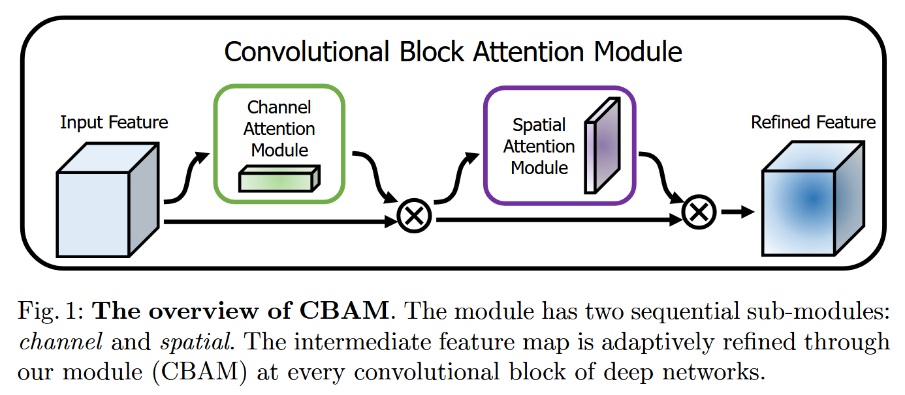
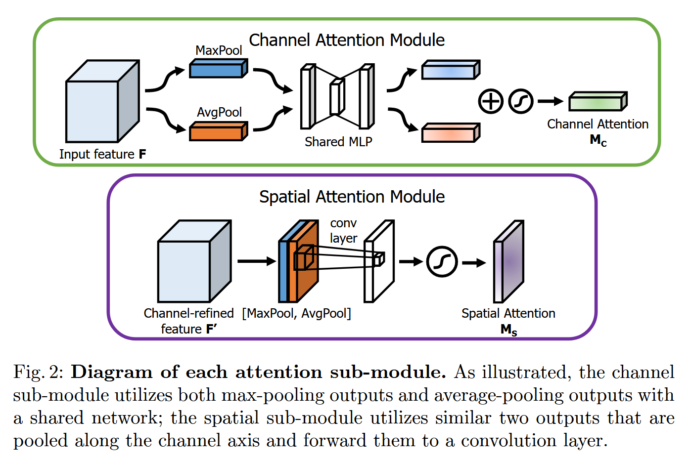
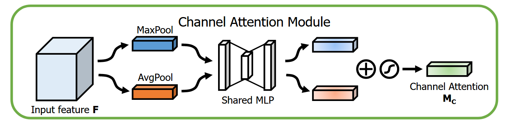
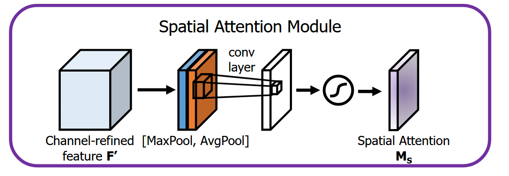

# CBAM（Convolutional Block Attention Module）

Computer Vision – ECCV 2018

卷积块注意力模块( Convolutional Block Attention Module，CBAM )，是一种简单有效的前馈卷积神经网络注意力模块。

给定一个中间特征图，CBAM 会沿着通道和空间两个独立的维度依次推断注意力图，然后将注意力图乘以输入特征图进行自适应的特征细化。

## introduction

卷积神经网络（CNNs）基于其丰富的表示能力，显著提升了视觉任务的性能。为了提高卷积神经网络的性能，最近的研究主要考察了网络的三个重要因素：深度、宽度和基数。

除了这些因素之外，我们还探讨了结构设计的另一个方面- -注意力。我们的目标是利用注意力机制提高表征力：关注重要特征并抑制不必要的特征。

由于卷积操作通过融合跨通道和空间信息来提取信息特征，因此我们采用我们的模块来强调沿着通道和空间轴两个主要维度的有意义的特征。三维特征图的单独注意力生成过程具有更少的计算和参数开销，因此可以作为现有基础CNN架构的即插即用模块。

**Contribution：**

1.  我们提出了一个简单而有效的注意力模块（CBAM），可以广泛地应用于提高 CNN 的表示能力。
2.  我们通过广泛的消融研究验证了我们的注意力模块的有效性。
3.  我们验证了通过插入我们的轻量级模块，在多个基准测试程序( ImageNet-1K , MS COCO和VOC 2007)上，各种网络的性能都得到了极大的提高。

## Module

给定一个中间特征图 $\mathbf{F} \in \mathbb{R}^{C \times H \times W}$作为输入，CBAM 依次推断一个 1D 通道注意力图 $\mathbf{M_c} \in \mathbb{R}^{C \times 1 \times 1}$ 和一个 2D 空间注意力图 $\mathbf{M_s} \in \mathbb{R}^{1 \times H \times W}$。

$$
\mathbf{F'} = \mathbf{M_c}(\mathbf{F}) \otimes \mathbf{F}, \\
\mathbf{F''} = \mathbf{M_c}(\mathbf{F'}) \otimes \mathbf{F'}
$$

### Channel Attention

对于空间信息的聚合，目前普遍采用平均池化方法。除此之外，该论文也认为最大池化收集了另一个关于不同对象特征的重要线索，以推断更精细的通道注意力。因此同时使用两种聚合方式。

$$
\begin{aligned}
\mathbf{M_c}(\mathbf{F}) & = \sigma(MLP(AvgPool(\mathbf{F})) + MLP(MaxPool(\mathbf{F}))) \\
      & = \sigma(\mathbf{W_1}(\mathbf{W_0}(\mathbf{F^c_{avg}})) + \mathbf{W_1}(\mathbf{W_0}(\mathbf{F^c_{max}})))
\end{aligned}
$$

### Spatial Attention

为了计算空间注意力，首先沿通道轴应用平均池化和最大池化操作，并将它们串联起来生成一个有效的特征描述子。之后使用一层卷积层产生空间注意力图。

$$
\begin{aligned}
\mathbf{M_s}(\mathbf{F}) 
	& = \sigma(f^{7 \times 7}([AvgPool(\mathbf{F});MaxPool(\mathbf{F})])) \\
	& = \sigma(f^{7 \times 7}([\mathbf{F_{avg}^s};\mathbf{F_{max}^s}]))
\end{aligned}
$$

## Conclusion

我们提出了卷积块注意力模块( CNN Block Attention Module，CBAM )，这是一种提高CNN网络表示能力的新方法。我们使用通道和空间两个不同的模块应用基于注意力的特征精化，在保持开销小的情况下实现了可观的性能提升。对于通道注意力，我们建议使用最大池化特征和平均池化特征，从而产生比SE更好的注意力\[ 28 ]。我们进一步通过利用空间注意力来提升性能。我们的最终模块( CBAM )学习什么和在哪里强调或抑制并有效地提炼中间特征。
