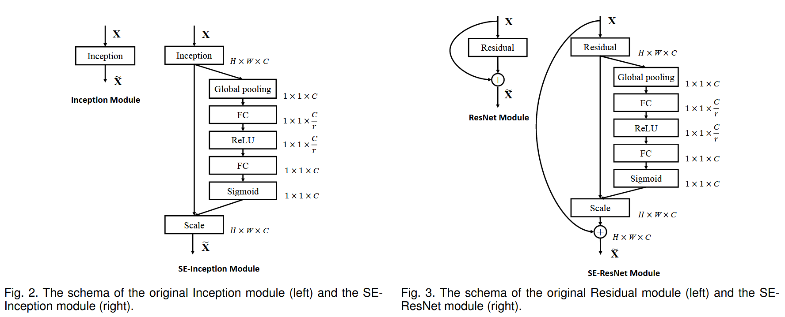
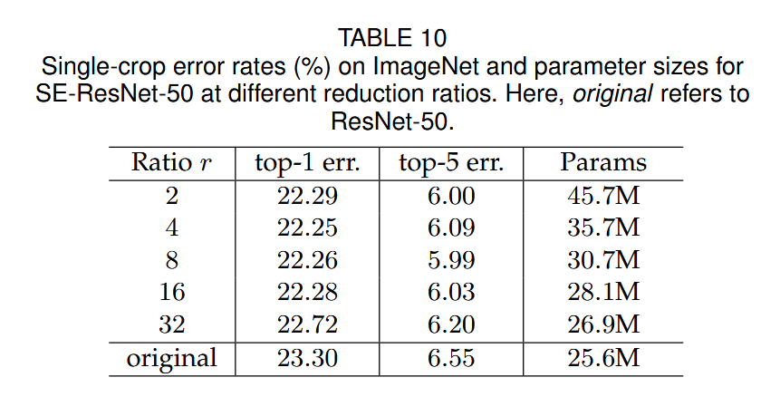
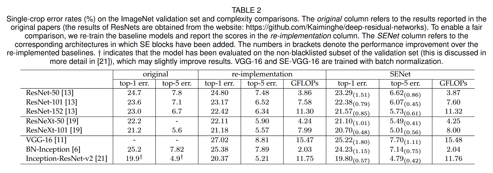

# SENet（Squeeze-and-Excitation Networks）

论文： \[Hu 等 - 2019 - Squeeze-and-Excitation Networks.pdf]\(..........\Zotero Cache\storage\I2DYCVY6\Hu 等 - 2019 - Squeeze-and-Excitation Networks.pdf)

Comment: journal version of the CVPR 2018 paper, accepted by TPAMI（IEEE Transactions on Pattern Analysis and Machine Intelligence）

该篇论文首次提出通道注意力。SE block 通过显式地模拟通道之间的相互依赖来自适应地调整通道的特征响应。

## Abstract

CNNs 的核心是卷积算子。能够通过每层的局部感受野融合空间和通道之间的信息，以此构建信息丰富的特征。为了提高网络的表示能力，许多现有的工作已经显示出增强空间编码的好处。

然而，该文的重点放在通道关系上，并提出了一种新的架构单元 "Squeeze-and-Excitation" ( SE )块，SE block 通过显式地模拟通道之间的相互依赖来自适应地调整通道的特征响应。

SE 块在增加少量计算成本的情况下为现有最先进的 CNN 带来了显著的性能提升。

## Introduction

计算机视觉研究的一个中心主题是寻找更强大的表示，这些表示只捕获图像中对给定任务最突出的属性，从而提高性能。

当前许多工作试图更好地建模空间依赖关系，并将空间注意力纳入网络结构。因此，该论文专注于通道之间的联系。

1.  我们引入了一个新的结构单元，我们称之为Squeeze-and-Excitation ( SE）块，其目标是通过显式建模卷积特征通道之间的相互依赖来提高网络生成的表示质量。
2.  提出一种机制，能够让网络执行特征校验，以学得使用全局信息来选择性地强调信息丰富的特征，并抑制不太有用的特征。

## Related Work

先前的这些研究大多集中在降低模型和计算复杂度的目标上，这反映了一个假设，即通道关系可以表示为具有局部感受野的实例无关函数的组合。相比之下，我们声称，为单元提供一种利用全局信息显式建模通道间动态、非线性依赖关系的机制可以简化学习过程，并显著增强网络的表示能力。

## Squeeze-Excitation Block

Squeeze-and-Excitation Block 是一个计算单元，它可以

通过一个变换 $F_{tr}$ 将输入 $\mathbf{X} \in \mathbb{R}^{H' \times W' \times C'}$ 映射为特征映射 $\mathbf{U} \in \mathbb{R}^{H \times W \times C}$。

其中，$\mathbf{F}_{tr}$ 表示卷积操作，$\mathbf{V} = [\mathbf{v}_1, \mathbf{v}_2, \cdots, \mathbf{v}_C]$ 表示学习到的卷积核的集合，$\mathbf{v}_c$ 表示第 $c$ 个卷积核的参数。

通过 $F_{tr}$ 卷积运算后，得到的输出 $\mathbf{U} = [\mathbf{u}_1, \mathbf{u}_2, \cdots, \mathbf{u}_C]$ 可以表示为：

$$
\mathbf{u}_c = \mathbf{v}_c * \mathbf{X} = \sum_{s=1}^{C'} \mathbf{v}_c^s * \mathbf{x}^s
$$

其中，$*$ 表示卷积，$\mathbf{v}_c = [\mathbf{v}_v^1, \mathbf{v}_v^2, \cdots, \mathbf{v}_v^{C'}]$，$\mathbf{X} = [\mathbf{x}^1, \mathbf{x}^2, \cdots, \mathbf{x}^{C'}]$，$\mathbf{u}_c \in \mathbb{R}^{H \times W}$。$\mathbf{v}_c^s$ 是一个 2D 空间核，代表 $\mathbf{v}_c$ 的一个单通道，作用在 $\mathbf{X}$ 的相应通道上。

由于输出是通过所有通道求和产生的，因此通道依赖隐式地嵌入在 $\mathbf{v}_c$ 中，而其又与卷积核捕获的局部空间相关性纠缠在一起。通过卷积建模的信道关系本质上是隐式的和局部的（除最上层外）。

我们期望通过显式地建模通道间依赖关系来增强卷积特征的学习，从而使网络能够增加其对信息特征的敏感性，这些信息特征可以被后续的变换所利用。因此，我们希望为其提供对全局信息的访问，并在将其馈送到下一个变换之前，分挤压和激励两步重新校准滤波器响应。

### Squeeze: Global Information Embedding

> In order to tackle the issue of exploiting channel dependencies, we first consider the signal to each channel in the output features. Each of the learned filters operates with a local receptive field and consequently each unit of the transformation output U is unable to exploit contextual information outside of this region.

由于通过 $\mathbf{F}_{tr}$ 生成的特征图 $\mathbf{U}$，其中每个通道维度的结果都是通过一个可学习的卷积核与局部感受野进行卷积所得。因此 $\mathbf{U}$ 的每个单元 $u_c(i,j)$ 都无法利用该区域之外的上下文信息。

为了解决该问题，该文

采用全局平均池化（GAP）方式来将全局空间信息压缩（Squeeze）到通道描述符中。

即，将包含了全局信息的 $\mathbf{U} \in \mathbb{R}^{H \times W \times C}$ 压缩至特征向量 $\mathbf{z} \in \mathbb{R}^{1 \times 1 \times C}$。

$$
z_c = \mathbf{F}_{sq}(\mathbf{u}_c) = \frac{1}{H \times W} \sum_{i=1}^H \sum_{j=1}^W u_c(i,j)
$$

实验验证，GAP 和 GMP 都能达到很好的效果。

### Excitation: Adaptive Recalibration

为了利用压缩操作中汇聚的信息，紧接着通过 Excitation 操作来全面捕获通道依赖性。

实现方法： 为了实现这个目标，这个功能必须符合两个标准：

*   第一，它必须是灵活的 （它必须能够学习通道之间的非线性交互）。
*   第二，它必须学习一个非互斥的关系。因为独热（One-Hot）激活相反，这里允许强调多个通道。

为了满足这些条件，该文选择一个使用 Sigmoid 激活函数的简单门控机制。

$$
\mathbf{s} = \mathbf{F}_{ex}(\mathbf{z},\mathbf{W}) = \sigma(g(\mathbf{z},\mathbf{W})) = \sigma(\mathbf{W}_2 \delta(\mathbf{W}_1 \mathbf{z}))
$$

采用了两层全连接构成的门机制，第一个全连接层把 $C$ 个通道压缩成了 $C/r$ 个通道来降低计算量，再通过一个 ReLU 非线性激活层，第二个全连接层将通道数恢复回为 $C$ 个通道，再通过 Sigmoid 激活得到权重 $\mathbf{s} \in \mathbb{R}^{1 \times 1 \times C}$，用来刻画特征图 $\mathbf{U}$ 中 $c$ 个特征图（Fature Map）的权重。其中 $r$ 是指压缩的比例。

> 此处，门机制为何如此设置，以及 $r$ 参数的选择

最后是 Scale 操作，将前面得到的注意力权重加权到每个通道的特征上。得到最终输出 $\tilde{\mathbf{X}} = [\tilde{\mathbf{x}}_1, \tilde{\mathbf{x}}_2, \cdots, \tilde{\mathbf{x}}_c]$。

$$
\tilde{\mathbf{x}}_c = \mathbf{F}_{scale}(\mathbf{u}_c, s_c) = s_c \mathbf{u}_c
$$

### 实例

SE Block 的灵活性，使其可以运用在卷积之外的变换。

## 模型和计算复杂度

## Ablation Study

[消融实验（ablation study）](https://blog.csdn.net/lianggua7074/article/details/135329137)：消融实验是一种[科学研究](https://so.csdn.net/so/search?q=%E7%A7%91%E5%AD%A6%E7%A0%94%E7%A9%B6\&spm=1001.2101.3001.7020)方法，用于确定一个条件或参数对结果的影响程度。当研究者提出了一个新的方案或方法时，消融实验通过逐一控制一个条件或参数，来观察结果的变化，以确定哪个条件或参数对结果的影响更大。

采用消融实验时，所使用的骨架为 ResNet-50，并在 FC Layer 抛弃 bias 以更好的建模通道之间的依赖关系及利用配置

### Reduction Rate

Reduction Rate r（超参数）用来平衡参数量和计算代价。结果实验证明 $r = 16$ 时能过使准确率和复杂度达到很好的平衡。在实际运用中，需要根据模型不同层的功能来灵活调整 $r$。

## Experiment

### Image Classification

在 ImageNet 2012 数据集上进行实验。

我们遵循标准做法，使用尺度和纵横比\[ 5 ]进行随机裁剪的数据增强，大小为224 × 224像素(或299 × 299用于Inception - ResNet - v2 和SE - Inception - ResNet - v2)，并进行随机水平翻转。每个输入图像通过平均RGB通道减法进行归一化。所有模型都在我们设计的分布式学习系统ROCS上进行训练，ROCS旨在处理大规模网络的高效并行训练。优化采用同步SGD，动量为0.9，小批量数据尺寸为1024。初始学习率设置为0.6，每30个历元下降10倍。模型从头开始训练100个历元，使用\[ 66 ]中描述的权重初始化策略。还原比r (第3 . 2节)设定为16，默认为(除非另有说明)。

在评估模型时，我们应用中心裁剪，以便在每个图像的较短边缘首先调整为256后，从每个图像中裁剪224 × 224像素(对于Inception-ResNet-v2和SE-Inception-ResNet-v2，每个图像的较短边缘首先调整为352)。

我们观察到，在计算复杂度增加极小的情况下，SE块在不同深度上的性能一直在提高。SE块本身也会增加深度，但它们的计算效率很高，即使在扩展基础结构的深度时也会产生良好的收益。

## Conclusion

本文提出的SE模块，这是一种新颖的架构单元，旨在通过使网络能够执行动态通道特征重新校准来提高网络的表示能力。大量实验证明了SENets的有效性，其在多个数据集上取得了最先进的性能。
