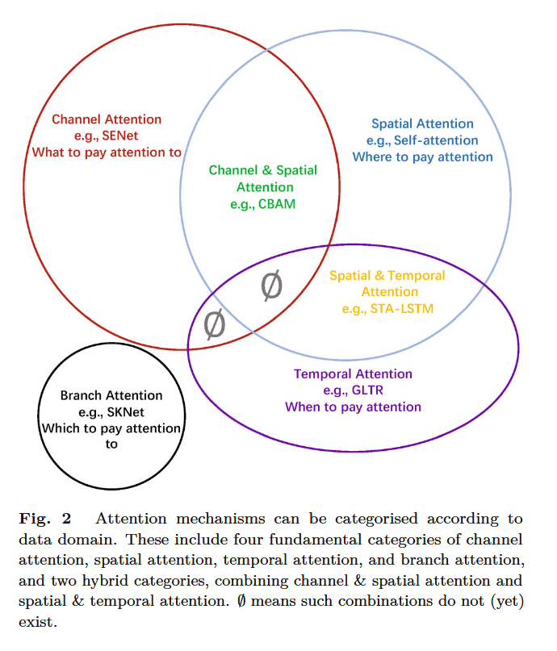
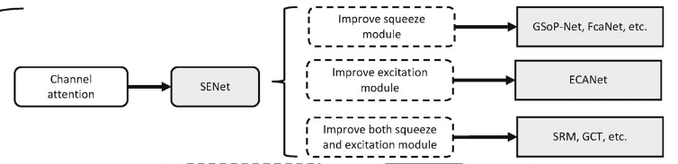
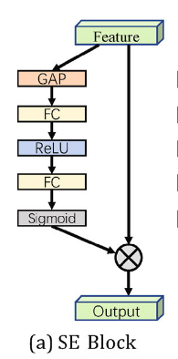
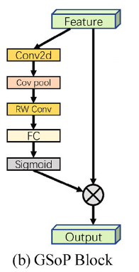
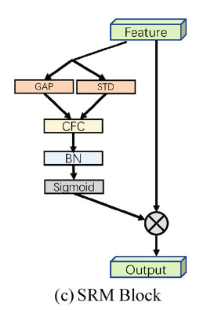
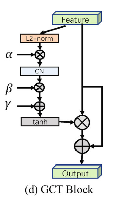
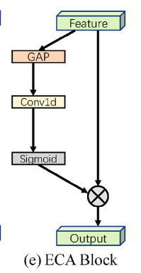
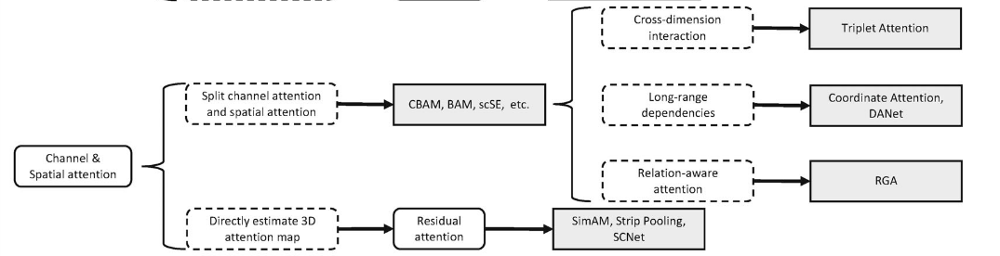

---
tags:
    - 注意力机制
    - CV
parent: 'Attention mechanisms in computer vision: A survey'
collections:
    - 综述
$version: 2918
$libraryID: 1
$itemKey: R29279AC

---
# 计算机视觉中的注意力机制

论文：Attention mechanisms in computer vision: A survey

2022-Computational Visual Media

(<a href="zotero://select/library/items/FVW4FAFP"><a href="zotero://select/library/items/FVW4FAFP">Guo 等, 2022</a></a>)

## 摘要

注意力机制是对人类视觉系统的模仿。

这种注意力机制可以看作是一个基于输入图像特征的动态权重调整过程。 (<a href="zotero://select/library/items/FVW4FAFP"><a href="zotero://select/library/items/FVW4FAFP">Guo 等, 2022, p. 331</a></a>)

注意力机制的运用领域：

*   图像分类
*   目标检测
*   语义分割
*   视频理解
*   图像生成
*   3D 视觉
*   多模态
*   自监督学习

[相关工作论文汇总](https://github.com/MenghaoGuo/Awesome-Vision-Attentions)链接

## 引言

注意力机制：将注意力转移到图像中最重要的区域而忽略无关部分的方法。

注意力机制发展的四个阶段：

*   第一阶段：将注意力机制和深度神经网络进行结合。
*   第二阶段（始于STN）：引入了一个子网络来预测一个仿射变换，用于选择输入中的重要区域。
*   第三阶段（始于SENet）：提出了一种新颖的通道注意力网络，隐式地、自适应地预测潜在的关键特征。
*   第四阶段：Self-Attention。

注意力机制分类：

*   通道注意力（channel attention）：需要注意什么。生成跨通道域的注意力掩膜，并利用其选择重要通道。
*   空间注意力（spatial attention）：哪里需要注意。生成跨空间域的注意力掩码，并使用它来选择重要的空间区域或预测
*   时间注意力（temporal attention）：何时需要注意
*   分支通道注意力（branch channel）：哪一个需要注意
*   通道和空间注意力（channel & spatial attention）
*   空间和时间注意力

## 计算机视觉中的注意力机制

在上图的分类讨论下，将会更深入地介绍了注意力策略的类别，考虑到它在动机、形成和功能方面的发展。

### 一般形式

当我们在日常生活中看到一个场景时，我们会将注意力集中在某个区域上，并对这些区域进行快速处理。” (<a href="zotero://select/library/items/FVW4FAFP"><a href="zotero://select/library/items/FVW4FAFP">Guo 等, 2022, p. 334</a></a>)

该过程的数学表示：$Attention=f(g(x), x)$

其中：

*   g(x)：表示产生注意力，这对应于注意到区别区域的过程。
*   f (g(x), x)：表示根据注意力 g(x) 处理输入 x（与处理关键区域和获取信息一致）。

### 通道注意力（Channel attention）

(<a href="zotero://select/library/items/FVW4FAFP"><a href="zotero://select/library/items/FVW4FAFP">Guo 等, 2022, p. 334</a></a>)

在深度神经网络中，不同特征图中的不同通道通常代表不同的对象。

<a href="zotero://open-pdf/library/items/J8CHCW9H?page=4&#x26;annotation=MM37M6UJ">“Channel attention adaptively recalibrates the weight of each channel, and can be viewed as an object selection process, thus determining what to pay attention to. Hu et al. [5] first proposed the concept of channel attention and presented SENet for this purpose.”</a> (<a href="zotero://select/library/items/FVW4FAFP"><a href="zotero://select/library/items/FVW4FAFP">Guo 等, 2022, p. 334</a></a>) 通道注意力自适应地重新校准每个通道的权重，可以看作是一个对象选择过程，从而决定关注什么。Hu等\[ 5 ]首次提出了通道注意力的概念，并为此提出了SENet。

改进通道注意力的三种方式：

#### SENet

SENet 首次提出通道注意力。

SENet 的核心是：SE Block（squeeze-and-excitation block）。SE 块用于收集全局信息，捕获通道之间的关系，提高表示能力。

SE 模块分为两个部分，挤压模块和激励模块。通过全局平均池化在压缩模块中收集全局空间信息。激励模块通过使用全连接层和非线性层( ReLU 和 Sigmoid)捕获通道间关系并输出注意力向量。然后，将输入特征的每个通道与注意力向量中的相应元素相乘进行缩放。

以 X 为输入、Y 为输出的挤压激励块$F_{se}$ (带参数 θ)可表示为

$s = F_{se}(X,\theta)=\sigma(W_2 \delta(W_1 GAP(X)))$

$Y = sX$

SE 块在抑制噪声的同时起到强调重要通道的作用。

由于它们的计算资源需求较低，可以在每个残差单元后添加一个SE块。

##### SENet 的缺点

*   在 squeeze module，GAP 对于捕获复杂的全局信息来说太简单。
*   在 excitation module，FC Layer 增加了模型的复杂度。

#### GSoP-Net

为了解决 SE 块在捕获复杂的全局信息能力不足和建模的问题。

GSoP-Net 使用全局二阶池化( GSoP )块对高阶统计量进行建模来改进压缩模块。

#### SRM

风格迁移（style transfer）的成功，基于此提出的SRM（style-based recalibration module）。SRM将风格迁移与注意力机制相结合。

SRM的主要贡献是风格池化，它利用输入特征的均值和标准差来提高其捕获全局信息的能力。它还采用了一个轻量级的通道级全连接( Channel-wise Fully-Connectating，CFC )层来代替原来的全连接层，以减少计算需求。

#### GCT

(<a href="zotero://select/library/items/FVW4FAFP"><a href="zotero://select/library/items/FVW4FAFP">Guo 等, 2022, p. 337</a></a>)

由于激励模块中全连接层的计算需求和参数数量，在每个卷积层后使用一个SE块是不切实际的。此外，使用全连接层来建模通道关系是一个隐式的过程。

#### ECANet

<a href="zotero://open-pdf/library/items/J8CHCW9H?page=7&#x26;annotation=I4EBSEIG">“To avoid high model complexity, SENet reduces the number of channels. However, this strategy fails to directly model correspondence between weight vectors and inputs, reducing the quality of results.”</a> (<a href="zotero://select/library/items/FVW4FAFP"><a href="zotero://select/library/items/FVW4FAFP">Guo 等, 2022, p. 337</a></a>) 🔤为避免模型复杂度高，SENet 减少了通道数。然而，该策略无法直接建模权重向量与输入之间的对应关系，降低了结果的质量。🔤

为了解决该问题，ECA-Net 使用一维卷积来确定通道之间的相互作用，而不是降维。

ECA 模块与 SE 模块具有相似的结构，包括用于聚合全局空间信息的压缩模块（GAP）和用于建模跨通道交互的高效激励模块。ECA 块只考虑每个通道与其k近邻之间的直接交互。

在 ECA-Net 中，Conv1d的卷积核大小能够通过通道维度 C 来自适应确定。

#### FcaNet

<a href="zotero://open-pdf/library/items/J8CHCW9H?page=8&#x26;annotation=FWI948H2">“Only using global average pooling in the squeeze module limits representational ability. To obtain a more powerful representation ability, Qin et al. [57] rethought global information captured from the viewpoint of compression and analysed global average pooling in the frequency domain. They proved that global average pooling is a special case of the discrete cosine transform (DCT) and used this observation to propose a novel multi-spectral channel attention.”</a> (<a href="zotero://select/library/items/FVW4FAFP"><a href="zotero://select/library/items/FVW4FAFP">Guo 等, 2022, p. 338</a></a>) 🔤仅在压缩模块中使用全局平均池化限制了表征能力。为了获得更强大的表示能力，Qin等\[ 57 ]从压缩的角度对捕获的全局信息进行了重新思考，并在频域分析了全局平均池化。他们证明了全局平均池化是离散余弦变换( DCT )的一个特例，并利用这一观察提出了一种新的多光谱通道注意力。🔤

<a href="zotero://open-pdf/library/items/J8CHCW9H?page=8&#x26;annotation=JEH7HM5D">“This work based on information compression and discrete cosine transforms achieves excellent performance on the classification task.”</a> (<a href="zotero://select/library/items/FVW4FAFP"><a href="zotero://select/library/items/FVW4FAFP">Guo 等, 2022, p. 338</a></a>)

#### EncNet

受SENet的启发，Zhang等\[ 53 ]提出了融合语义编码损失( SE-loss )的上下文编码模块( CEM )来建模场景上下文与目标类别概率之间的关系，从而利用全局场景上下文信息进行语义分割。

#### Bilinear attention

<a href="zotero://open-pdf/library/items/J8CHCW9H?page=8&#x26;annotation=GFLNAA42">“Following GSoP-Net [54], Fang et al. [147] claimed that previous attention models only use first-order information and disregard higher-order statistical information. They thus proposed a new bilinear attention block (bi-attention) to capture local pairwise feature interactions within e”</a> (<a href="zotero://select/library/items/FVW4FAFP"><a href="zotero://select/library/items/FVW4FAFP">Guo 等, 2022, p. 338</a></a>) 🔤在GSoP - Net \[ 54 ]之后，Fang等人\[ 147 ]声称之前的注意力模型只使用一阶信息而忽略了高阶统计信息。因此，他们提出了一种新的双线性注意力块( bi- attention )来捕获e内的局部成对特征交互🔤

### 通道注意力

(<a href="zotero://select/library/items/FVW4FAFP"><a href="zotero://select/library/items/FVW4FAFP">Guo 等, 2022, p. 339</a></a>)

空间注意力可以看作是一种自适应的空间区域选择机制：在何处关注。

#### RAM

CNNs 具有巨大的计算成本，特别是对于巨大的输入情况。

为了将有限的计算资源集中到重要的区域上。Mnih 等人提出了循环注意力模型( RAM )，该模型采用RNNs \[ 148 ]和强化学习( RL ) \[ 149 ]使网络学习到需要关注的地方。RAM开创了使用RNN进行视觉注意的先河，随后出现了许多其他基于RNN的方法。

#### 硬注意力和软注意力

为了可视化图像描述生成模型应该关注的位置和内容，Xu等\[ 35 ]引入了基于注意力的模型以及两种不同的注意力机制，硬注意力和软注意力。

？

#### Attention gate

以往的MR（Magnetic Resonance，核磁共振）图像分割方法通常在特定的感兴趣区域( Region of Interest，ROI )上操作，这需要过度浪费计算资源和模型参数。

为解决该问题所提出一种简单高效的机制（attention gate，AG）将注意力集中在目标区域，同时抑制无关区域的特征激活。

给定输入 $X$ 和初略裁剪并包含上下文信息的门信号 $G\in \mathbb{R}^{C' \times H \times W}$。注意力门采用额外的注意力获得门控系数。首先通过一次线性映射将输入 $X$ 和门信号 $G$ 映射到 $\mathbb{R}^{F \times H \times W}$ 维度空间；之后在通道维度压缩产生空间注意力权重 $S \in \mathbb{R}^{1 \times H \times W}$

“It is general and modular, making it simple to use in various CNN models.” (<a href="zotero://select/library/items/FVW4FAFP"><a href="zotero://select/library/items/FVW4FAFP">Guo 等, 2022, p. 341</a></a>) 🔤它具有通用性和模块化的特点，使其在各种CNN模型中的使用变得简单。🔤

#### Self-attention

Self-attention 首先运用在 NLP 领域，目前在 CV 领域也有很大的潜力。

<a href="zotero://open-pdf/library/items/J8CHCW9H?page=12&#x26;annotation=X57HP2XM">“Typically, selfattention is used as a spatial attention mechanism to capture global information.”</a> (<a href="zotero://select/library/items/FVW4FAFP"><a href="zotero://select/library/items/FVW4FAFP">Guo 等, 2022, p. 342</a></a>) 🔤通常，自注意力作为一种空间注意力机制来捕获全局信息。🔤

<a href="zotero://open-pdf/library/items/J8CHCW9H?page=12">“由于卷积操作的局部性，CNN固有的较窄的感受野[ 155、156 ]，限制了CNN对场景的全局理解能力。”</a> (<a href="zotero://select/library/items/FVW4FAFP"><a href="zotero://select/library/items/FVW4FAFP">Guo 等, 2022, p. 342</a></a>)为了增加感受野的范围，Wang 等人将 Self-attention 引入 CV。

以一张 2维图片为例，给定一张特征图 $F \in \mathbb{R}^{C \times H \times W}$，Self-attention 首先会计算 Query、Key、Value $\in \mathbb{R}^{C’ \times N}$ 矩阵。其中 $N = H \times W$ 通过线性投影和重塑操作计算得。

$A = (a)_{i,j} = Softmax(QK^T)$

$Y = AV$

$A \in \mathbb{R}^{N × N}$ 为注意力矩阵，$( a )_{i,j}$ 为第i个和第j个元素之间的关系。

<a href="zotero://open-pdf/library/items/J8CHCW9H?page=12&#x26;annotation=L7QVW765">“However, the self-attention mechanism has several shortcomings, particularly its quadratic complexity, which limit its applicability.”</a> (<a href="zotero://select/library/items/FVW4FAFP"><a href="zotero://select/library/items/FVW4FAFP">Guo 等, 2022, p. 342</a></a>) 🔤然而，自注意力机制有一些缺点，特别是它的二次复杂性，限制了它的适用性。🔤

### Channel & spatial attention

Channel & spatial attention 结合了通道注意力和空间注意力两者的优势。它能自适应选择重要的对象和区域。

<a href="zotero://open-pdf/library/items/J8CHCW9H?page=19&#x26;annotation=ZICNPC92">“The residual attention network [119] pioneered the field of channel &#x26; spatial attention, emphasizing the importance of informative features in both spatial and channel dimensions. It adopts a bottom–up structure consisting of several convolutions to produce a 3D (height, width, channel) attention map.”</a> (<a href="zotero://select/library/items/FVW4FAFP"><a href="zotero://select/library/items/FVW4FAFP">Guo 等, 2022, p. 349</a></a>) 🔤残差注意力网络\[ 119 ]开创了通道和空间注意力领域的先河，强调信息特征在空间和通道两个维度上的重要性。它采用由多个卷积组成的自下而上的结构来产生3D (高度、宽度、通道)注意力图。🔤然而，它具有很高的计算代价和有限的感受野。

#### CBAM

(<a href="zotero://select/library/items/FVW4FAFP"><a href="zotero://select/library/items/FVW4FAFP">Guo 等, 2022, p. 350</a></a>)

为了增强信息通道和重要区域，Woo等人\[ 6 ]提出了卷积块注意力模块( CBAM )，将通道注意力和空间注意力串联起来。它将通道注意力图和空间注意力图解耦以提高计算效率，并通过引入全局池化来利用空间全局信息。

CBAM 有通道注意力、空间注意力两个子模块。给定一个输入特征图 X∈RC × H × W，依次推断1D通道注意力向量sc∈RC和2D空间注意力图 $s_s \in \mathbb{R}^{H \times W}$。

通道注意力子模块的形式与SE块类似，但是采用的是 maxpool 和 avgpool 两个并行池化分支来聚合全局信息。即：

$$
\begin{flalign}
& F_{avg}^c = GAP^s(X) \\
& F_{max}^c = GMP^s(X) \\
& s_c = \sigma(W_2 \delta(W_1 F_{avg}^c) + W_2 \delta(W_1 F_{max}^c)) \\
& M_c(X) = s_c X
\end{flalign}
$$

空间注意力子模块通过大核卷积层来生成注意力图，以此对特征的空间关系进行建模，与通道注意力形成互补。

$$
\begin{flalign}
& F_{avg}^s = GAP^c(X) \\
& F_{max}^s = GMP^c(X) \\
& s_s = \sigma(Conv([F_{avg}^s; F_{max}^s])) \\
& M_s(X) = s_s X
\end{flalign}
$$

$GAP^s$ 和 $GMP^s$ 表示运用在空间域，而 $GAP^c$ 和 $GMP^c$ 表示应用在通道域。

CBAM 强调有用的渠道以及增强信息的地方区域。由于其轻量级的设计，CBAM 可以无缝地集成到任何 CNN 架构中，而额外的成本可以忽略不计。

尽管如此，通道和空间注意力机制仍有改进的空间。例如，CBAM采用卷积来产生空间注意力图，因此空间子模块可能会受到有限的感受野的影响。
