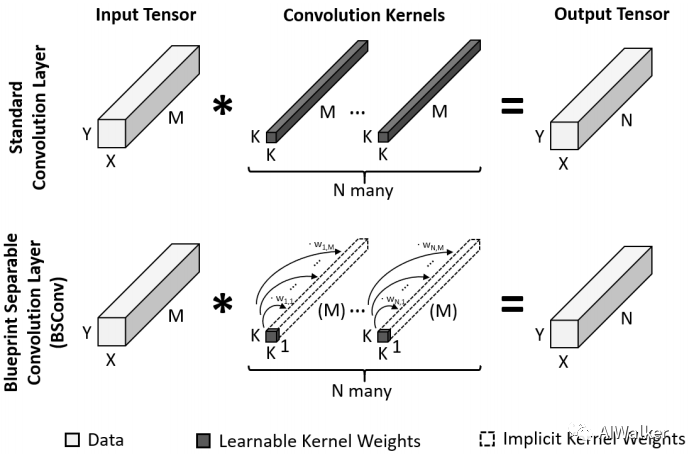

[toc]

# 蓝图可分离卷积

论文地址：https://arxiv.org/abs/2003.13549

代码地址：https://github.com/zeiss-microscopy/BSConv

## 1. BSConv

BSConv 是深度可分离卷积（DSConv）的升级版本，它更好地利用内核内部相关性来实现高效分离。具体而言，BSConvU 是将一个标准的卷积分解为 1 x 1 卷积（PW）和一个逐通道卷积，是深度可分离卷积（DSConv—逐通道、逐点）的逆向版本。此外，BSConv 还有一个变体操作 — BSConvS。

受启发于预训练模型的核属性的量化分析：深度方向的强相关性。作者提出一种“蓝图分离卷积”（Blueprint Separable Convolutions, BSConv）作为高效 CNN 的构建模块。

基于该发现，作者构建了一套理论基础并用于推导如何采用标准 OP 进行高效实现。更进一步，所提方法为深度分离卷积的应用（深度分离卷积已成为当前主流网络架构的核心模块）提供了系统的理论推导、可解释性以及原因分析。最后，作者揭示了基于深度分离卷积的网络架构（如MobileNet）隐式的依赖于跨核相关性；而所提 BSConv 则基于核内相关性，故可以为常规卷积提供一种更有效的拆分。

作者通过充分的实验（大尺度分类与细粒度分类）验证了所提 BSConv 可以明显的提升 MobileNet 以及其他基于深度分离卷积的架构的性能，而不会引入额外的复杂度。对于细粒度问题，所提方法取得 13.7% 的性能提升；在 ImageNet 分类任务，BSConv 在 ResNet 的“即插即用”取得了 9.5% 的性能提升。

## 2. BSConv 结构

在标准卷积中，每个卷积层对输入张量 $U \in \mathbb{R}^{M \times Y \times X}$ 进行变化得到输出张量$V \in \mathbb{R}^{N \times Y \times X}$，相应的卷积核为 $F^{(1)}, \cdots , F^{(N)}$，每个卷积核的尺寸为 $M \times K \times K$。相应的公式可以描述为：
$$
V_{n,i,i} = U \times F^{n}, \quad n \in \{1, 2, \cdots, N \}
$$
这些卷积核将通过反向传播方式进行优化训练。

预训练 CNN 中的卷积核可以通过一个模板以及 $M$ 个因子进行近似。该发现也是本文 BSConv 的驱动源泉，它为滤波器卷积提供另一种定义方式。
$$
F_{m,i,i}^n = w_{n,m} \cdot B^{(n)},\quad m \in \{1, 2, \cdots, M \}, \quad n \in \{1, 2, \cdots, N \}
$$
尽管上述定义为滤波器添加了硬约束，但作者通过实验表明：相比标准卷积，所提方法可以达到相同甚至更优的性能。另外，需要注意的是：标准卷积的可训练参数为 $M \cdot N \cdot K^2$，而所提方法仅具有 $N \cdot K^2 + M \cdot N$ 个可训练参数。