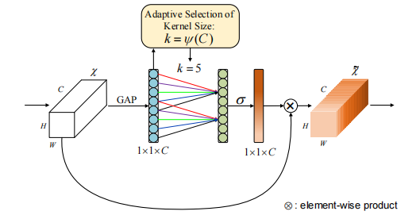
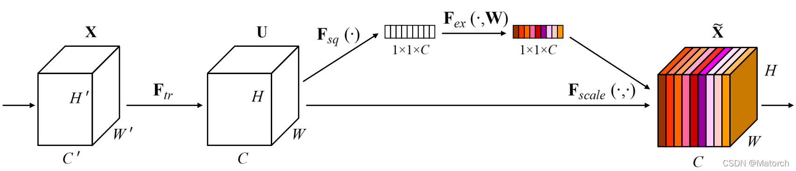
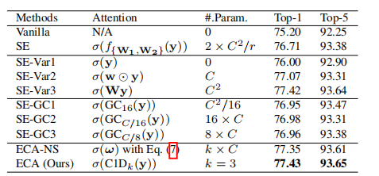
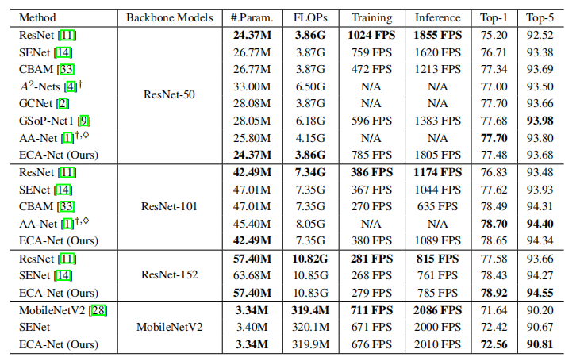

[toc]

# ECA-Net: Efficient Channel Attention for Deep Convolutional Neural Networks 


## 摘要

> ​	论文提出一种只包含少量参数、执行效率更高的模型——Efficient Channel Attention（ECA）module。用于克服性能和复杂性之间的矛盾。
>
> ​	在这篇论文中，作者提出了一种不降维的局部跨通道交互策略（local cross channel interaction strategy ），该策略可以通过一维卷积有效地实现。和一种自适应选择一维卷积核大小的方法，以确定局部跨通道相互作用的覆盖范围。
>
> ​	在以 ResNets 和 MobileNetV2 为骨干，对 ECA 模块在图像分类、目标检测和实例分割方面进行了测试，结果表明 ECA Module 是更有效、更高效的，性能优于同类模块。

## 介绍

​	CNNs 广泛运用在 CV 领域，并在许多任务中取得了巨大的进展。如：图像分类、目标识别、语义分割等。

​	如今，将通道注意力（CAM）加入到卷积块在性能的提升中展现出了巨大的潜力。如：SE-Net（squeeze-and-excitation networks）。

​	许多工作通过捕获更复杂的通道之间的关系，或结合额外的空间注意力来改进 SE Block。但这些方式在提高准确率的同时，也带来了更高的复杂性和计算量。根据经验研究表明，**降维对通道注意力的预测带来了副作用，而且捕捉所有通道的依赖关系是低效和不必要的。**

​	文中提出的 ECA Module 可以避免降维、通过一种有效的方式来捕获跨通道的交互，能够用于深度 CNNs。



​	在不降维的情况下进行通道全局平均池化后，ECA 通过考虑每个通道和它的 k 个近邻来捕捉局部跨通道交互。注意到，ECA 可以通过大小为 k 的一维卷积快速实现，其中内核大小 k 表示局部跨通道交互的覆盖率（即有多少邻居参与一个通道的注意力预测）。

​	为了避免通过交叉验证手动调整 k，本文开发了一种自适应确定 k 的方法，其中覆盖率相互作用的大小（即内核大小 k）与通道成正比。

本文的贡献总结如下：

- （1）本文剖析了 SE 块，并通过实验证明避免降维和适当的跨通道交互对学习有效和高效的通道注意力的重要性。
- （2）基于以上分析，本文尝试为深度 CNN 开发一个极其轻量级的通道注意力模块，提出了高效通道注意力（ECA），在带来明显改进的同时，模型的复杂性增加很少。
- （3）在 ImageNet-1K 和 MS COCO 上的实验结果表明，本文的方法比最先进的方法具有更低的模型复杂性，同时取得了非常有竞争力的性能。

## 相关工作

​	事实证明，注意力机制是增强深度 CNN 的一个潜在手段。SE-Net 首次提出了一种学习通道注意力的有效机制，并取得了优秀的成绩。在这之后，注意力模块的发展可以大致分为两个方向：

- 增强特征聚合。
- 结合通道注意力和空间注意力（CBAM）。具体来说，CBAM 采用了平均和最大池化两种方式来聚合特征。

文章列举的部分工作中，大多数基于 NL（Non-Local）的注意力模块由于其较高的模型复杂性，只能用于单个或几个卷积块。显然，上述所有的方法都侧重于开发复杂的注意力模块以获得更好的性能。

​	ECA 模块旨在捕获局部跨通道交互，它与通道局部卷积和通道之间卷积有一些相似之处；与之不同的是，我们的方法研究了一种自适应核大小的一维卷积来取代通道注意力模块中的 FC 层。与分组卷积和深度可分离卷积相比，该方法具有更好的性能和更低的模型复杂度。

## 提出方法

### SE Block 中的通道注意力

[Squeeze-and-Excitation Networks](https://arxiv.org/pdf/1709.01507.pdf)

​	SE Block 的组成为：FC + ReLU + FC + Sigmoid。



​	让一个卷积块的输出为 $X \in \Bbb{R}^{W \times H \times C}$，其中 W、H 和 C 是宽度、高度和通道尺寸（即卷积核的数量）。据此，SE 块中的通道权重可以计算为：
$$
w = \sigma(f_{\{W_1,W_2\}} (g(\mathcal{X}))) \quad (1)
$$
其中 $g(\mathcal{X}) = \frac{1} {WH} \begin{matrix} \sum_{i=1,j=1}^{W,H} \mathcal{X}_{ij} \end{matrix}$ 是逐通道的全局平均池化（GAP）对应图中 $F_{sq}(\cdot)$，$\sigma$ 是一个 Sigmoid 函数。

​	令 $y = g(\mathcal{X})$，则 $f_{\{ W_1,W_2\}}$ 的形式为：
$$
f_{\{ W_1,W_2\}}(y) = W_2ReLU(W_1 y) \quad (2)
$$
其中 ReLU 表示整流线性单元。为了避免模型的高复杂性，$W_1$ 和 $W_2$ 的大小分别被设定为 $C \times (\frac {C} {r})$ 和 $ (\frac {C} {r}) \times C$ 。即将这 $W_1$ 压缩到 C / r 个通道；将 $W_2$ 展开到 C 个通道。

​	可以看到，$f_{\{ W_1,W_2\}}$ 涉及通道注意块的所有参数。**虽然公式（2）中的降维可以降低模型的复杂性，但它破坏了通道和其权重之间的直接对应关系。**

​	例如，一个单一的 FC 层使用所有通道的线性组合来预测每个通道的权重。但公式（2）首先将通道特征投射到一个低维空间，然后再将其映射回来，这使得通道和其权重之间的对应关系是间接的。

### 避免降维



​	公式（2）中的降维使得通道和其权重之间的对应关系是间接的。为了验证其效果，本文将原始的 SE 块与它的三个变体（即 SE-Var1、SE-Var2 和 SE-Var3）进行比较，它们都不进行降维。
​	如上表所示，没有参数的 SE-Var1 仍然优于原始网络，表明通道注意力有能力提高深度 CNN 的性能。同时，SE-Var2 独立学习每个通道的权重，在涉及较少参数的情况下，略优于 SE 块。这可能表明，通道和它的权重需要直接对应，而避免降维比考虑非线性通道依赖性更重要。此外，SE-Var3 采用一个单一的 FC 层比两个 FC 层在 SE 块中的降维表现更好。

​	所有上述结果清楚地表明，避免降维有助于学习有效的信道注意力。因此，本文开发了没有通道降维的 ECA 模块。

### 局部跨通道交互

​	对于未降维的聚合特征 $y\in \Bbb{R}^{C}$，通道注意力可以通过以下方式学习：
$$
w = \sigma(Wy)
$$
其中 $W$ 是一个 $C \times C$ 的参数矩阵。

​	特别是，对于 SE-Var2 和 SE-Var3，SE-Var2 的 $W_{var2}$ 是一个对角矩阵，涉及 $C$ 个参数；SE-Var3 的 $W_{var3}$ 是一个全矩阵，涉及 $C \times C$ 个参数。这两者关键的区别是 SE-Var3 考虑了跨通道交互，而 SEVar2 没有，因此 SE-Var3 取得了更好的性能。

​	这一结果表明，跨通道交互有利于学习频道注意力。然而，SEVar3 需要大量的参数，导致模型的复杂性很高，特别是对于大的通道数量。

​	在这篇论文中，使用一个频带矩阵 $W_k$ 来学习频道注意力，而 $W_k$ 如下：

$W_k$ 涉及 $k \times C$ 个参数，并且避免了不同组之间的完全独立。对于 $W_k$ 来说，$y_i$ 的权值 $w_i$ 的计算只考虑  $y_i$ 与其 k 个相邻节点的相互作用。即：
$$
w_i= \sigma(\sum_{j = 1}^k w_i^j y_i^j) \qquad y_i^j \in \Omega_i^k
$$
其中，$\Omega_i^k$ 表示 $y_i$ 的 k 个相邻通道的集合。

​	一个更有效的方法是使所有通道共享相同的学习参数，即：
$$
w_i= \sigma(\sum_{j = 1}^k w^j y_i^j) \qquad y_i^j \in \Omega_i^k
$$
​	这种策略可以很容易地通过内核大小为 k 的快速一维卷积来实现，即：
$$
w = \sigma(C1D_k(y))
$$
​	上式的方法被称为高效信道关注（ECA）模块，它只涉及k个参数。

### 局部跨通道交互的覆盖范围

​	ECA 模块旨在适当地捕捉局部的跨通道交互，所以需要确定交互的覆盖范围（即 1D 卷积的核大小 k）。对于各种 CNN 结构中具有不同通道数的卷积块，可以手动调整优化的交互覆盖率。然而，通过交叉验证进行手动调整将花费大量的计算资源。

​	**组卷积已经成功地被采用来改进 CNN 架构，在组数固定的情况下，高维（低维）通道涉及长距离（短距离）卷积。**分享类似的理念，交互的覆盖率（即一维卷积的核大小）与通道维度 C 成正比是合理的。 即，在 k 和 C 之间可能存在一个映射 $\phi$ 。即：
$$
C = \phi(k)
$$
​	最简单的映射是一个线性函数，即 $\phi(k)=\gamma * k - b$。然而，线性函数所描述的关系太有限了。另一方面，众所周知，通道维度 C（即滤波器的数量）通常被设定为 2 的幂。因此，本文引入一个可能的解决方案，将线性函数 $\phi(k)=\gamma * k - b$ 扩展为非线性函数，即：
$$
C = \phi(k) = 2^{(\gamma * k - b)}
$$
之后，只要给定信道维度 C，内核大小 k 就可以通过以下方式自适应确定：
$$
k = \psi(C) = \left\vert \frac {\log_{2} {C}} {\gamma} + \frac {b} {\gamma} \right\vert_{odd}
$$
其中 $|t|_{odd}$ 表示为最近的奇数 t 个对象。在本文中，将 $\gamma$ 和 $b$ 分别设置为 2 和 1。显然，通过映射 $\psi$，高维通道有较长的范围互动，而低维通道通过使用非线性映射发生较短的范围互动。

### ECA-Net

​	在使用不降维的 GAP 聚合卷积特征后，ECA 模块首先自适应地确定卷积核大小 k，然后执行一维卷积，接着使用 Sigmoid 函数来学习通道注意力。


​	为了将本文的 ECA 应用于深度 CNN，本文按照 SE-Net 中的相同配置，用本文的 ECA 模块取代 SE 块。由此产生的网络被命名为 ECA-Net。

```python
def EfficientChannelAttention(x, gamma=2, b=1):
    # x: input features with shape [N, C, H, W]
    # gamma, b: parameters of mapping funcion
    N, C, H, W = x.size()
    
    # 自适应地确定卷积核大小 k
    t = int(abs((log(C, 2) + b) / gamma))
    k = t if t % 2 else t + 1
    
    avg_pool = nn.AdaptiveAvgPool2d(1)
    conv = nn.Conv1d(1, 1, kernel_size=k, padding=int(k/2), bias=False)
    
    y = avg_pool(x)
    y = conv(y.squeeze(-1).transpose(-1, -2))
    y = y.transpose(-1, -2).unsqueeze(-1)
    
    return x * y.expand_as(x)
```

## 实验

​	本文分别使用 ImageNet 和 MS COCO 对所提出的方法在大规模图像分类、物体检测和实例分割上进行评估。具体来说，本文首先评估了内核大小对 ECA 模块的影响，并与 ImageNet 上最先进的对应模块进行比较。然后，本文使用 Faster R-CNN、Mask R-CNN 和 RetinaNet 验证 ECA-Net 在 MS COCO 上的有效性。

### 实施细节

​	在 ImageNet 分类上评估 ECA-Net，采用了四种广泛使用的 CNN 作为主干模型。包括 ResNet-50 、ResNet-101、ResNet-512 和 MobileNetV2。

​	***为了使用 ECA 在 ResNet 上训练，本文采用 [Deep residual learning for image recognition，SE-Net] 中完全相同的数据增强和超参数设置。***即：

- 输入图像通过随机水平翻转、随机裁剪为 224 × 224。
- 网络的参数通过随机梯度下降（SGD）进行优化，权重衰减（weight decay ）为 1e-4，动量（momentum ）为 0.9，小批量大小（mini-batch size ）为 256。
- 所有的模型都是在 100 个 epoch 内通过设置初始学习率（learning rate）为 0.1，每 30 个 epoch 减少 10 个系数来训练的。

​	***为了使用 ECA 在 MobileNetV2 上训练，本文遵循 MobileNetV2 中的设置。***即：

- 在 400 个 epoch 内用 SGD 训练网络，权重衰减为 4e-5，动量为 0.9，小批量大小为 96。
- 初始学习率被设定为 0.045，并通过 0.98 的线性衰减率来降低。
- 为了在验证集上进行测试，输入图像的短边首先被调整为 256，并使用 224 × 224 的中心裁剪进行评估。

​	在 MS COCO 目标检测上进一步评估 ECA-Net，本文使用 Faster R-CNN、Mask R-CNN 和 RetinaNet ，其中 ResNet-50 和 ResNet-101 以及 FPN 被用作骨干模型。

通过使用 MMDetection 工具包实现所有检测器，并采用默认设置。即：

- 输入图像的短边被调整为 800，然后使用 SGD 优化所有模型，权重衰减为 1e-4，动量为 0.9，小批量大小为 8（4 个 GPU，每个 GPU 有 2 张图像）。
- 学习率初始化为 0.01，并在 8 和 11 个 epoch 后分别降低 10 倍。
- 本文在 COCO 的 train2017 上训练 12 个 epoch 内的所有检测器，并在 val2017 上报告结果以进行比较。

### 在 ImageNet-1K  上的图像分类

在这里，本文首先评估核大小对ECA模块的影响，并验证本文的方法自适应地确定核大小的有效性，然后使用ResNet-50、ResNet-101、ResNet-152和MobileNetV2与最先进的同行和CNN模型进行比较。


​	ECA 模块使用 ResNet-50 和 ResNet-101 作为主干模型，并使用 k 为 [3, 9] 的 ECA 模块进行训练。从中得到以下结果：


本文的ECA模块使用ResNet-50和ResNet-101作为主干模型，具有不同的k数。这里，本文也给出了自适应选择核大小的ECA模块的结果，并与SENet作为基线进行了比较。

- 当 k 在所有卷积块中固定时，ECA 模块对于 ResNet-50 和 ResNet-101 分别在 k = 9 和 k = 5 时获得最佳结果。由于ResNet101 有更多控制性能的中间层，因此它可能更喜欢较小的内核大小。
- 不同深度的 CNNs 有着不同的最佳 k 值，k 值对 ECA-Net 的性能有明显的影响。
- ResNet-101 的精度波动（∼0.5%）大于 ResNet-50 的精度波动（∼0.15%），本文推测这是因为较深的网络比较浅的网络对固定的核大小更敏感。
- 具有不同数量 k 的 ECA 模块始终优于 SE 块，验证了避免降维和局部跨通道交互对学习通道注意具有积极影响。

#### 使用不同的 Deep CNNs 进行比较



- ResNet-50：ECA-Net 与原始 ResNet-50 具有几乎相同的模型复杂性（网络参数、FLOPs 和速度)。而 Top-1 精度提高了 2.28%。与最先进的同类产品（即SENet、CBAM、A2-Nets、AA-Net、GSoP-Net1 和 GCNet）相比，ECA-Net 获得了更好或更具竞争力的结果，同时有利于降低模型复杂性。
- ResNet-101：ECA-Net 在几乎相同的模型复杂度下，性能比原始的 ResNet-101 高 1.8%。在 ResNet-50 上，ECA-Net 也有相同的趋势，但它优于 SENet 和 CBAM，而在模型复杂度较低的情况下，它与 AA-Net 非常有竞争力。注意，AA-Net 是用初始数据扩充和不同的学习率设置来训练的。
- ResNet-152：ECA-Net 在 Top-1 精度方面比原始 ResNet-152 提高了约 1.3%，而模型复杂度几乎相同。与 SENet 相比，ECANet 以较低的模型复杂度获得了 0.5% 的 Top-1 增益。关于 ResNet-50、ResNet101 和 ResNet-152的 结果证明了本文的 ECA 模块在广泛使用的 ResNet 架构上的有效性。
- 除了 ResNet 架构，本文还在轻量级 CNN 架构上验证了 ECA 模块的有效性。为此，本文采用 MobileNetV2 作为主干模型，并将本文的 ECA 模块与 SE 块进行比较。特别地，本文在残差连接位于 MobileNetV2 的每个“瓶颈层”之前在卷积层中集成 SE 块和 ECA 模块，并且 SE 块的参数 r 被设置为 8。所有模型都使用完全相同的设置进行训练。上表中的结果显示，本文的 ECA-Net 在 Top-1 准确性方面分别将原始 MobileNetV2 和 SENet 提高了约 0.9% 和 0.14%。

此外，本文的ECA-Net比SENet具有更小的模型规模和更快的训练/推理速度。以上结果再次验证了ECA模块的效率和有效性。

Comparisons with Other CNN Models
在这一部分的最后，本文将ECA-Net50和ECA-Net101与其他最先进的CNN模型进行了比较，包括ResNet-200 、Inception-v3 、ResNeXt 、DenseNet。这些CNN模型具有更深更广的架构，它们的结果都是从原始论文中复制的。如下表所示，ECA-Net101优于ResNet-200，表明本文的ECA-Net可以使用少得多的计算成本来提高深度CNN的性能。


Comparisons with state-of-the-art CNNs on ImageNet.

同时，本文的ECA-Net101与ResNeXt-101相比非常有竞争力，而后者使用了更多的卷积滤波器和昂贵的组卷积。此外，ECA-Net50与DenseNet-264 (k=32)、DenseNet-161 (k=48)和Inception-v3相当，但其模型复杂度更低。所有上述结果表明，本文的ECA-Net性能优于最先进的CNN，同时受益于低得多的模型复杂度。请注意，本文的ECA也有很大的潜力来进一步提高比较CNN模型的性能。

Object Detection on MS COCO
在这一小节中，本文使用faster R-CNN 、Mask R-CNN 和RetinaNet来评估本文的ECA-Net在对象检测任务上的性能。本文主要将ECA-Net与ResNet和SENet进行比较。所有CNN模型都在ImageNet上进行预训练，然后通过微调转移到MS COCO。
Comparisons Using Faster R-CNN
使用faster R-CNN作为基本检测器，本文使用50和101层的ResNets以及FPN 作为主干模型。如下表所示，SE模块或ECA模块的集成可以显著提高目标检测的性能。同时，在使用ResNet-50和ResNet-101的AP方面，本文的ECA分别优于SE block 0.3%和0.7%。


Object detection results of different methods on COCO val2017.

Comparisons Using Mask R-CNN
本文进一步利用Mask R-CNN来验证ECA-Net在目标检测任务上的有效性。如上表所示，在50层和101层的设置下，本文的ECA模块在AP方面分别优于原始ResNet 1.8%和1.9%。同时，使用ResNet50和ResNet-101作为主干模型，ECA模块分别比SE模块获得0.3%和0.6%的增益。使用ResNet-50，ECA优于一个NL ，并且与使用较低模型复杂性的GC块相当。
Comparisons Using RetinaNet
此外，本文使用一级检测器，即RetinaNet，验证了本文的ECA-Net在对象检测上的有效性。如上表所示，在50层和101层网络的AP方面，本文的ECA-Net分别比原始ResNet高出1.8%和1.4%。
同时，ECANet对ResNet-50和ResNet-101的SE-Net分别提高了0.2%和0.4%以上。总之，上表中的结果表明，本文的ECA-Net可以很好地推广到对象检测任务。具体来说，ECA模块带来了对原始ResNet的明显改进，同时使用较低的模型复杂性胜过SE块。特别是，本文的ECA模块对小物体实现了更大的增益，这些小物体通常更难被检测到。
Instance Segmentation on MS COCO
然后，在MS COCO上给出了本文的ECA模块使用Mask R-CNN的实例分割结果。如下表所示，ECA模块与原始ResNet相比获得了显著的增益，同时性能优于SE模块，且模型复杂度较低。对于作为主干的ResNet-50，模型复杂度较低的ECA优于NL，与GC block 相当。这些结果验证了ECA模块对各种任务具有良好的泛化能力。


COCO val2017上使用Mask R-CNN的不同方法的实例分割结果。

