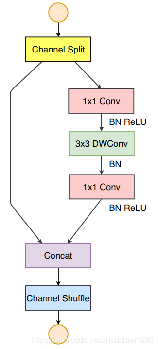

[toc]

# SA-Net

论文地址：[SA-Net: Shuffle Attention for Deep Convolutional Neural Networks](http://arxiv.org/abs/2102.00240)

Code：https://github.com/wofmanaf/SA-Net

注意力机制如今已经被广泛用于卷积神经网络中，大大提升了很多任务上的性能表现。目前视觉中的注意力机制主要有两种，如下图所示，分别是***通道注意力***和***空间注意力***。


*通道注意力*着重于捕获通道之间的依赖，而*空间注意力*则关于像素之间的关系捕获。不过**它们都是通过不同的聚合策略、转换方法和强化函数，*从所有位置聚合相同的特征来强化原始特征*。**

CBAM 和 GCNet 同时处理空间和通道信息，获得了较好的精度提升，然而它们通常存在收敛困难、计算负担大等问题。

也有一些工作关于简化注意力结构，如 ECA-Net 将 SE 模块中通道权重的计算改用了 1D 卷积来简化。SGE 沿着通道维度对输入进行分组形成表示不同语义的子特征，在每个子特征上进行空间注意力。

***遗憾的是，这些方法都没用很好地利用空间注意力和通道注意力之间的相关性，所以效率偏低。***所以自然而然引出这篇文章的出发点：能否以一个高效轻量的方式融合不同的注意力模块？

先回顾一下轻量级网络的代表之一的 ShuffleNetv2，它构建了一个可并行的多分支结构，如图所示。



在每个单元的入口，含有 $C$ 个通道的输入被分割为 $C − C'$ 和 $C'$ 两个分支，接着几个卷积层用来提取关于输入更高级的信息，然后结果 concat 到一起保证和输入通道数相同，最后 Channel Shuffle 操作用来进行两个分支之间的信息通讯。类似的，SGE 将输入沿着通道分组，所有子特征并行增强。

## Shuffle Attention

基于这些前人的工作，论文提出了一种更加轻量但更加高效的 ***Shuffle Attention（SA）模块***。

它也是将输入按照通道进行分组，对每组子特征，使用 Shuffle Unit 来同时构建通道注意力和空间注意力。对每个注意力模块，论文还设计了针对每个位置的注意力掩码来抑制噪声加强有效的语义信息。

论文主要的贡献为设计了一个轻量但是有效的注意力模块——SA Module。它将输入特征图按照通道分组并对每个分组用 Shuffle Unit 实现空间注意力和通道注意力。


### 1. 特征分组

特征分组将输入特征图分为多组，每组为一个子特征（Sub-Feature）。

具体来看，输入特征图 $X \in \mathbb{R}^{C \times H \times W}$ 被沿着通道维度分为 $G$ 组，表示为 $X = [X_{1}, \cdots, X_{G}], X_{k} \in \mathbb{R}^{C / G \times H \times W}$，其中每个子特征 $X_k$ 随着训练会逐渐捕获一种特定的语义信息。这部分对应图中最左边的 **Group 标注**的部分。

### 2. 通道注意力和空间注意力

之后，$X_k$ 会被分为两个分支（**Split 标注部分**），依然是沿着通道维度划分。两个子特征表示为 $X_{k1}, X_{k2} \in \mathbb{R}^{C / 2G \times H \times W}$。

如上图中间 **Split 标注后**的部分，两个分支分别是绿色和蓝色表示。上面的绿色分支实现通道注意力开采通道之间的依赖，下面的蓝色分支则捕获特征之间的空间依赖生成空间注意力图。这样，模型同时完成了语义和位置信息的注意。

具体来看通道注意力这个分支，这里没用采用 SE 模块的设计，主要是考虑到轻量化设计的需求（SE 的参数还是比较多的），也没有使用 ECA-Net 的设计采用一维卷积（ECA-Net 要想精度高，对卷积核尺寸要求比较大），而是采用最简单的 **GAP + Scale + Sigmoid** 的单层变换。具体公式如下：
$$
s = \mathcal{F}_{gp} (X_{k1}) = \frac {1} {H \times W} \sum_{i=1}^{H} \sum_{j=1}^{W} X_{k1} (i, j) \\
X_{k1}' = \sigma(\mathcal{F}_c (s)) \cdot X_{k1} = \sigma(W_1 s + b_1) \cdot X_{k1}
$$
上面的式子只有两个变换参数，即 $W_1 \in \mathbb{R}^{C / 2G \times 1 \times 1}$ 和 $b_1 \in \mathbb{R}^{C / 2 G \times 1 \times 1}$。

下面来看空间注意力这个分支。先是对输入特征图进行 Group Norm，然后也是通过一个变换 $\mathcal{F}_c(\cdot)$ 来增强输入的表示。具体公式如下：
$$
X_{k2}' = \sigma(W_2 \cdot GN(X_{k2}) + b_2) \cdot W_{k2}
$$
这里的参数也只有 $W_2 \in \mathbb{R}^{C / 2G \times 1 \times 1}$ 和 $b_2 \in \mathbb{R}^{C / 2 G \times 1 \times 1}$。

最后，两种注意力的结果 concat 到一起 $X_k' = [X_{k1}', X_{k2}'] \in \mathbb{R}^{C/G \times H \times W}$，此时它已经和该组的输入尺寸一致了。

### 3. 聚合

最后一步聚合，通过 ShuffleNetv2 采用的 Channel Shuffle 操作来保证各组子特征之间的交互，最后得到和输入 $X$ 同维的注意力图。这部分对应图中最右边的 **Aggregation 标注**的部分。

至此，SA 模块的构建已经完成，其中 $W_1$、$b_1$、$W_2$、$b_2$ 就是整个 SA 模块所有的参数。SA 模块可以取代 SE 模块，因此替换 SENet 的网络称为 SA-Net。

```python
def ShuffleAttention(X, cw, cb, sw, sb, G):
    # x: input features with shape [N, C, H, W]
    # cw, cb, sw, sb: parameters with shape [1, C//G, 1, 1]
    # G; number of groups
    N, _, H, W = x
    
    # group into subfeatures
    x = x.reshape(N * G, -1, H, W)
    
    # channel split
    x_0, x_1 = x.chunk(2, dim=1)
    
    # channel attention
    xn = avg_pool(x_0)
    xn = cw * xn + cb
    xn = x_0 * sigmoid(xn)
    
    # spatial attention
    xs_GroupNorm(x_1)
    xs = sw * xs + sb
    xs = x_1 * sigmoid(xs)
    
    # concatenate and aggragate
    out = torch.cat([xn, xs], dim=1)
    out = out.shape(N, -1, H, W)
    
    # channel shuffle
    out = channel_shuffle(out, 2)
    return out
```

## 通道混洗

```python
"""
	通道混洗
"""
def channel_shuffle(x, groups):
    # input
    batch_size, channels, height, width = x.data.size()
    # group
    channels_per_group = channels // groups
    # reshape
    x = x.view(batch_size, groups, channels_per_group, height, width)
    # transpose
    x = torch.transpose(x, 1, 2).contiguous()
    # flatten
    x = x.view(batch_size, -1, height, width)
    return x
```

