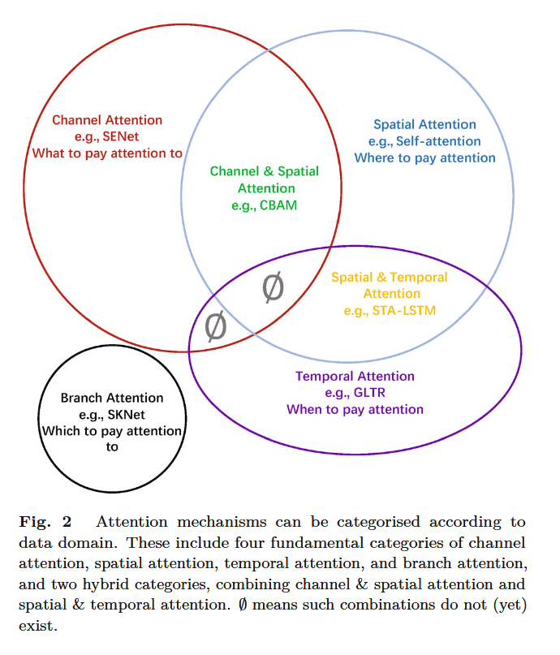
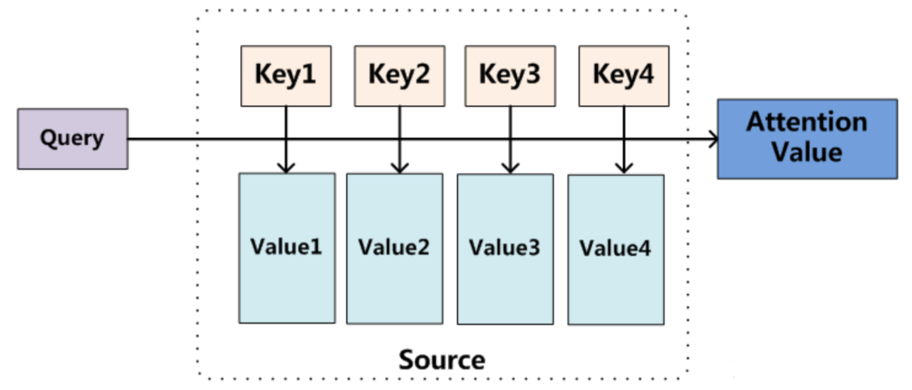

# Attention Mechanism

注意力机制是对人类视觉系统的模仿，将注意力转移到图像中最重要的区域，而忽略无关部分的方法。这种注意力机制可以看作是一个基于输入图像特征的动态权重调整过程。

当我们在日常生活中看到一个场景时，我们会将注意力集中在某个区域上，并对这些区域进行快速处理。该过程的数学表示：$Attention=f(g(x), x)$

其中：

*   $g(x)$：表示产生注意力，这对应于注意到区别区域的过程。
*   $f (g(x), x)$：表示根据注意力 $g(x)$ 处理输入 $x$（与处理关键区域和获取信息一致）。

## 1. 注意力机制的分类

根据数据域来分类：

*   通道注意力（channel attention）：需要注意什么。生成跨通道域的注意力掩膜，并利用其选择重要通道。
*   空间注意力（spatial attention）：哪里需要注意。生成跨空间域的注意力掩码，并使用它来选择重要的空间区域或预测
*   时间注意力（temporal attention）：何时需要注意
*   分支通道注意力（branch channel）：哪一个需要注意
*   通道和空间注意力（channel & spatial attention）
*   空间和时间注意力

## 2. 注意力机制的原理

注意力机制（Attention Mechanism）是机器学习中的一种数据处理方法，广泛应用在自然语言处理、图像识别以及语音识别等各种不同类型的机器学习任务中。注意力机制对不同信息的关注程度（重要程度）由**权值**来体现，注意力机制可以视为**查询矩阵**（Query）、**键**（key）以及**加权平均值**构成了多层感知机（Multilayer Perceptron, MLP）。

注意力的思想类似于寻址。给定目标（Target）中的某个元素 Query，通过计算 Query 和各个 Key 的**相似性**（或**相关性**），得到每个 Key 对应 Value 的**权重系数**，然后对 Value 进行加权求和，即得到最终的 Attention 数值。

所以，**本质上 Attention Mechanism 是 Source 中元素的 Value 值进行加权求和，而 Query 和 Key 用来计算对应 Value 的权重系数。**

其中，Source 由一系列的 $<Key, Value>$ 键值对构成；**Query** 为给定的 Target 元素；**Key** 是 Source 中元素的 Key值；**Value**是 Source 中元素的 Value 值；

**权重系数**：$Similarity(Query, Key_i)$ 为 Query 与 key 的相似性或相关性，权重系数：**Attention Value**：对 Value 值进行加权求和。

根据注意力机制的原理可知，其计算公式为：
$$
Attention(Query, Source) = \sum_{i=1}^{||Source||} Similarity(Query, Key_i) * Value_i
$$
Attention 从大量信息中有选择地筛选出少量重要信息并聚焦到这些重要信息上，忽略大多不重要的信息。聚焦的过程体现在权重系数的计算上，权重越大，越聚焦在对应的 Value 值上，即权重代表了信息的重要性，而 Value 是其对应的信息。

## 3. 注意力机制的计算过程

大多数方法采用的注意力机制计算过程可以细化为如下三个阶段。

- 第一阶段，计算 Query 和不同 Key 的相关性。即计算不同 Value 值的权重系数。
- 第二阶段，对上一阶段的输出进行归一化处理，将数值的范围映射到 0 和 1 之间。
- 第三阶段，根据权重系数对 Value 进行加权求和，从而得到最终的注意力数值。

## 4. 通道注意力（Channel Attention）

在深度神经网络中，可以认为不同特征图中的不同通道通常代表不同的对象。通道注意力自适应地重新校准每个通道的权重，可以看作是一个对象选择过程，从而决定关注什么。Hu 等\[ 5 ]首次提出了通道注意力的概念，并为此提出了 SENet。

[SENet](D:\Notes\Study\深度学习\文献\Attention Mechanism\SENet---Squeeze-and-Excitation-Networks-FP8DVTZM.md)

## 5. 空间注意力（Spatial Attention）

空间注意力可以看作是一种自适应的空间区域选择机制：在何处关注。

## 6. 混合注意力（Channel & Spatial Attention）

