[toc]

# 注意力机制

## 1. 注意力机制概念

注意力是人类认知系统的核心部分，它允许我们在各种感官输入中筛选和专注于特定信息。这一能力帮助我们处理海量的信息，关注重要的事物，而不会被次要的事物淹没。

受到人类认知系统的启发，计算机科学家开发了注意力机制，这种机制模仿人类的这种能力，强化特定数据特征，忽略无关部分。

人类的视觉系统能够在某个特定区域上进行 “高分辨率” 的聚焦，就像你仔细观察黄色框中的尖耳朵一样。同时，我们可以在 “低分辨率” 下感知周围的环境，例如注意到背景中的雪景和穿着打扮，然后根据这些线索调整我们的注意力或做出推断。

当你关注图像中的一小部分时，周围的像素会提供相关信息，帮助你理解这个小部分应当展示什么。之所以在黄色框中期待看到一只尖耳朵，是因为我们已经看到了一些提示。比如狗的鼻子、右边的另一只尖耳朵，以及柴犬的眼睛（红色框中的部分）。然而，图像底部的毛衣和毯子可能没有这些狗的特征那样明显或有用。

在深度学习领域，我们可以用简单的例子来解释注意力的概念。比如我们在阅读一个句子时，当看到 “eating” 这个词时，我们会立即预期接下来可能会出现一个与食物相关的词。而下图绿色和红色的词，可能用来描述食物，但直接与 “eating” 关联的可能性较小。

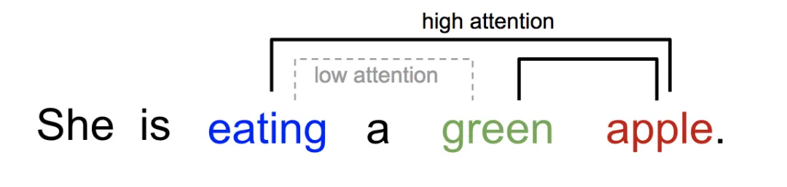

## 2. 注意力机制的原理

注意力机制（Attention Mechanism）是机器学习中的一种数据处理方法，广泛应用在自然语言处理、图像识别以及语音识别等各种不同类型的机器学习任务中。

注意力机制对不同信息的关注程度（重要程度）由**权值**来体现，注意力机制可以视为**查询矩阵**（Query）、**键**（key）以及**加权平均值**构成了多层感知机（Multilayer Perceptron, MLP）。

注意力的思想，类似于寻址。给定 Target 中的某个元素 Query，通过计算 Query 和各个 Key 的**相似性**（或**相关性**），得到每个 Key 对应 Value 的**权重系数**，然后对 Value 进行加权求和，即得到最终的 Attention 数值。所以，本质上 Attention 机制是 Source 中元素的 Value 值进行加权求和，而 Query 和 Key 用来计算对应 Value 的权重系数。

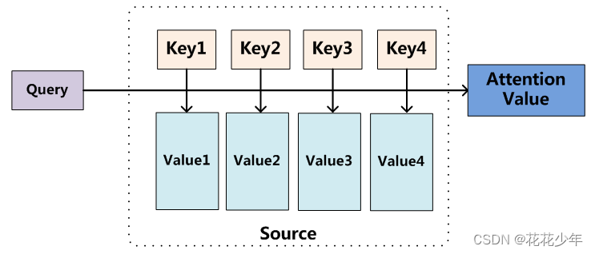

- Source：由一系列的 <Key, Value> 键值对构成。

- **Query**：给定的 Target 元素。

- **Key**：Source 中元素的 Key 值。

- **Value**：Source 中元素的 Value 值
- **权重系数**：Query 与 key 的相似性或相关性，权重系数 $Similarity(Query_i,\;Key_i)$。
- **Attention Value**：对 Value 值进行加权求和。

根据注意力机制的原理可知，其计算公式如下：
$$
Attention(Query, \; Source) \; = \; \sum_{i=1}^{L_x} Similarity(Query_i, \; Key_i) * Value_i
$$
其中，$L_x \; = \; \parallel Source \parallel$，表示 Source 的长度。

Attention 从大量信息中有选择地筛选出少量重要信息并聚焦到这些重要信息上，忽略大多不重要的信息。聚焦的过程体现在权重系数的计算上，权重越大，越聚焦在对应的 Value 值上，即权重代表了信息的重要性，而 Value 是其对应的信息。

## 3. 注意力机制的计算过程

大多数方法采用的注意力机制计算过程可以细化为如下三个阶段。

- 第一阶段，计算 Query 和不同 Key 的相关性。即计算不同 Value 值的权重系数。
- 第二阶段，对上一阶段的输出进行归一化处理，将数值的范围映射到 0 和 1 之间。
- 第三阶段，根据权重系数对 Value 进行加权求和，从而得到最终的注意力数值。

### 3.1 第一阶段

计算 Query 和不同的 Key 的相似性或者相关性  s~i~，即计算不同 Value 值的权重系数。用 $f$ 表示：$f(Q,K_i) \quad i=1,2,\cdots,m$。 一般第一步计算方法包括四种：
1. 点乘（**Transformer 使用**）：$f(Q,K_i)=Q^TK_i$
2. 权重：$f(Q,K_i)=Q^TWK_i$
3. 拼接权重：$f(Q,K_i)=W[Q^T;K_i]$
4. 感知器：$f(Q,K_i)=V^Ttanh(WQ+UK_i)$

### 3.2 第二阶段

第二步：将得到的相似度进行 Softmax 操作，进行归一化：$\alpha_i=softmax(\frac{f(Q,K_i)}{\sqrt{d_k}})$

对第一阶段得到的原始权重进行 Softmax  归一化处理，将数值的范围映射到 0 和 1 之间。

根据产生方法的不同，第一阶段产生的分值的取值范围也不一样，第二阶段引入类似 SoftMax 的计算方式对第一阶段的得分就行数值转换。

一方面，可以进行归一化，将原始计算分值整理成所有元素权重之和为 1 的概率分布；另一方面，通过 SoftMax 的内在机制更加突出重要元素的权重。即一般采用如下公式：
$$
a_i \; = \; Softmax(Sim_i) \; = \; \frac {e^{Sim_i}} {\begin{matrix} \sum_{j=1}^{L_x} e^{Sim_j} \end{matrix}}
$$

### 3.3 第三阶段

根据权重系数 $\alpha_i$ 对 Value 进行加权求和，从而得到最终的注意力数值。
$$
Attention \; = \; \sum_{i=1}^{L_x} \alpha_i*Value_i
$$

## 4. 自注意力机制

- 向量的内积是什么？如何计算？其几何意义是什么？
- 一个矩阵 $W$ 与其自身的转置 $W^T$ 相乘，得到的结果有什么意义？

### 4.1 键值对（Key - Value）注意力

键值对（Key - Value）Attention 最核心的公式如下：
$$
Attention(Q,K,V) \; = \; Softmax(\frac {QK^T} {\sqrt{d_k}})V
$$
上图是大名鼎鼎的 Attention Function。第一眼看过去，哦，两个向量相乘除以一个像是 Normalization 的向量的平方根，然后做一个 Softmax 处理，最后再乘以一个向量。我相信大家第一眼看到这个公式是非常懵逼的，假如你懵逼了，那么下面的这个公式各位是否知道其意义呢？
$$
Softmax(XX^T)X
$$
我们先抛开 $Q, \, K, \, V$ 三个矩阵不谈，Self-Attention 最原始的形态其实长上面这样。那么这个公式到底什么意思呢？

首先，$XX^T$，一个矩阵乘以它的转置，会得到什么结果，有什么意义呢？

我们知道，矩阵可以看作由一些向量组成，一个矩阵乘以它自己转置的运算，其实可以看成这些向量分别与其他向量计算内积。（此时脑海里想起矩阵乘法的口诀，第一行乘以第一列、第一行乘以第二列......嗯哼，矩阵转置以后第一行不就是第一列吗？这是在计算第一个行向量与自己的内积，第一行乘以第二列是计算第一个行向量与第二个行向量的内积，第一行乘以第三列是计算第一个行向量与第三个行向量的内积.....）

回想我们上面提出的问题，**向量的内积，其几何意义是什么？**

**答：表征两个向量的夹角，表征一个向量在另一个向量上的投影。**

记住这个知识点，我们进入一个超级详细的实例：

我们假设 $X \, = \, [x_1^T; \, x_2^T ;\, x_3^T]$，其中 $X$ 为一个二维矩阵，$s_i^T$ 为一个行向量（很多教材默认是列向量，但为了方便理解，此处还是写成行向量）。对应下面的图，$s_1^T$ 对应“早”字 embedding 之后的结果，以此类推。

下面的运算模拟了一个过程，即 $XX^T$。我们来看看其结果究竟有什么意义。

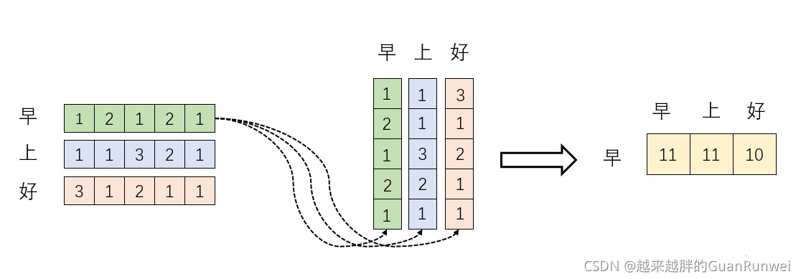

首先，行向量 $s_i^T$ 分别与自己和其他两个行向量做内积（“早”分别与“上”、“好”计算内积），得到了一个新的向量。我们回想前文提到的向量的内积表征两个向量的夹角，表征一个向量在另一个向量上的投影。那么新的向量有什么意义呢？新的向量是行向量 $s_i^T$ 在自己和其他两个行向量上的投影。投影值大和小又有什么意义呢？

**投影值大，意味两个向量相关度高。我们考虑，如果两个向量夹角是90°，那么这两个向量线性无关，完全没有相关性。**

更进一步，这两个向量是词向量，是词在高维空间的数值映射。词向量之间相关度高表示什么？是不是在一定程度上（不是完全）表示，在关注词 A 的时候，应给予词 B 更多的关注？

上图展示了一个行向量运算的结果，那么矩阵的意义是什么呢？

**矩阵 $XX^T$ 是一个方阵，我们以行向量的角度理解，里面保存了每个向量和自己与其他向量进行内积运算的结果。**

至此，我们理解了公式 $Softmax(XX^T)X$ 中 $XX^T$ 的意义（关联性）。我们进一步，Softmax 的意义何在呢？请看下图：

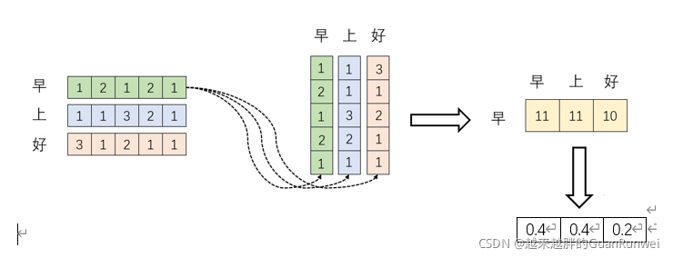

大家都知道 Softmax 的意义就是归一化。

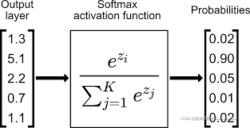

我们结合上图的理解，Softmax 之后，这些数字的和为 1 了，那么 **Attention 的核心机制是什么？那不就是加权求和**么？那么权重怎么来的呢？就是这些归一化之后的数字。当我们关注“早”这个字的时候，我们应该分配 0.4 的注意力（Attention）给它本身，剩下 0.4 的注意力给“上”，最后的 0.2 的注意力给“好”。当然具体到我们的 Transformer，就是对应向量的运算了，这是后话。

行文至此，我们对这个东西是不是有点熟悉？Python 中的热力图 Heatmap，其中的矩阵是不是也保存了相似度的结果？

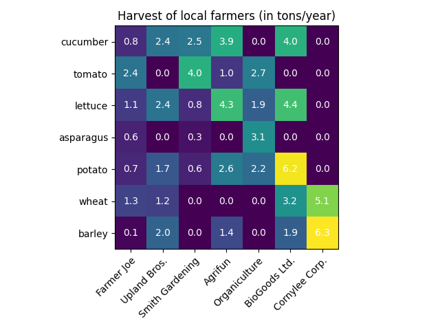

但，对于 $Softmax(XX^T)X$，我们仅仅理解了一半，最后一个$X$ 有什么意义呢？完整的公式究竟表示什么呢？我们继续之前的计算。请看下图。

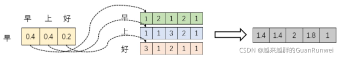

我们取 $Softmax(XX^T)X$ 的一个行向量举例。这个行向量与 $X$ 的一个列向量相乘，表示什么？

观察上图，行向量 $[0.4,0.4,0.2]$ 与 $X$ 的第一个列向量 $[1,1,3]$ 相乘，得到一个新的行向量 $[1.4]$，且这个行向量与 $X$ 的维度相同。

在新的向量中，每一个维度的数值都是由三个词向量在这一维度的数值加权求和得来的，这个新的行向量就是"早"字词向量经过注意力机制加权求和之后的表示。

一张更形象的图是这样的，图中右半部分的颜色深浅，其实就是我们上图中黄色向量中数值的大小，意义就是单词之间的相关度（**回想之前的内容，相关度其本质是由向量的内积度量的**）

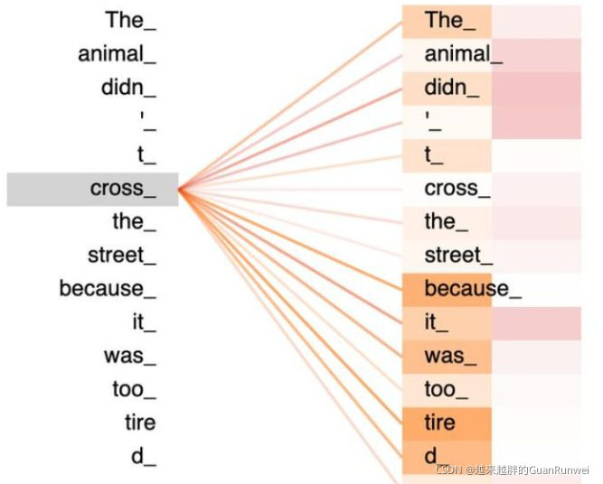

### 4.2 Q K V 矩阵

在我们之前的例子中并没有出现 $Q,K,V$ 的字眼，因为其并不是公式中最本质的内容。$Q,K,V$ 究竟是什么？我们看下面的图。

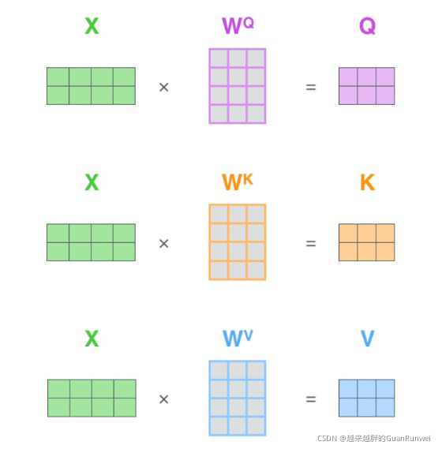

其实，许多文章里所谓的 $Q,K,V$ 矩阵、查询向量之类的字眼，其来源都是与矩阵的乘积，本质上都是的线性变换。那么为什么不直接使用 $X$ 而要对其进行线性变换呢？

当然是为了提升模型的拟合能力，矩阵 $W$ 都是可以训练的，起到一个缓冲的效果。

如果你真正读懂了前文的内容，读懂了 $Softmax(XX^T)X$ 这个矩阵的意义，那么你也就理解了所谓查询向量这一类的字眼的含义。

### 4.3 $\sqrt{d_k}$ 的意义

假设 $Q,K$ 里的元素的均值为 0，方差为 1，那么 $A^T=Q^TK$ 中元素的均值为 0，方差为 d。当 d 变得很大时，$A$ 中的元素的方差也会变得很大。如果 $A$ 中的元素方差很大，那么 $Softmax(A)$ 的分布会趋于陡峭（分布的方差大，分布集中在绝对值大的区域）。

总结一下就是 $Softmax(A)$ 的分布会和 d 有关。因此 $A$ 中每一个元素除以 $\sqrt {d_k}$ 后，方差又变为 1。这使得 $Softmax(A)$ 的分布“陡峭”程度与 d 解耦，从而使得训练过程中梯度值保持稳定。

## 5. 注意力机制分类

注意力是人类认知系统的核心部分，它允许我们在各种感官输入中筛选和专注于特定信息。这一能力帮助我们处理海量的信息，关注重要的事物，而不会被次要的事物淹没。

受到人类认知系统的启发，计算机科学家开发了注意力机制，这种机制模仿人类的这种能力，强化特定数据特征，忽略无关部分。

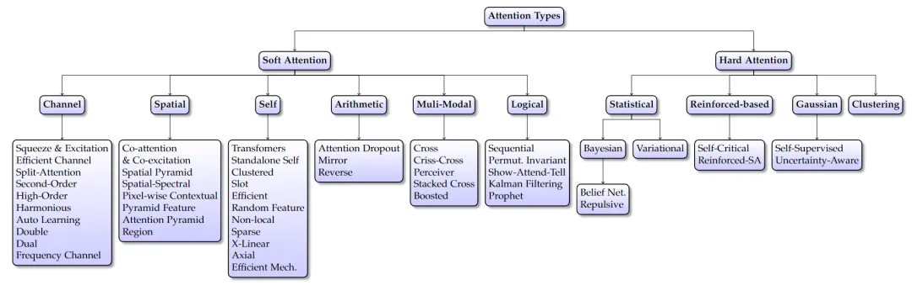

注意力机制在深度学习中的应用十分广泛，并且有多种分类方法，我这里的划分方式主要是参考这篇论文，以下是更详细的注意力机制分类及其应用：

### 4.1 软注意力（Soft Attention）

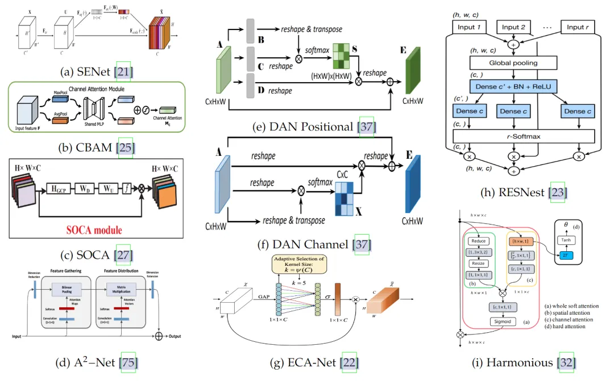

图 1 展示了基于通道的注意力方法的核心结构。

不同的方法用于生成注意力得分，包括压缩和激发 [26]、分裂和压缩 [23]、计算二阶 [37] 或高效压缩和激发 [22]。这些图像来自原始论文。

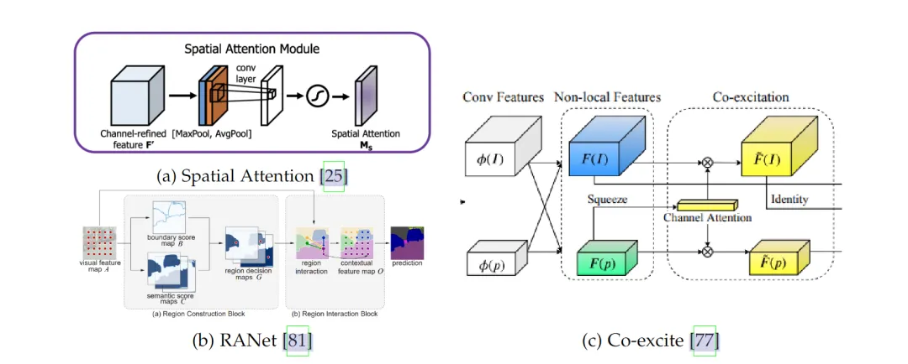

图 2 展示了基于空间的注意力方法的结构，包括 RANet [81] 和 Co-excite [77]。

这些方法着重关注空间地图中最重要的部分。

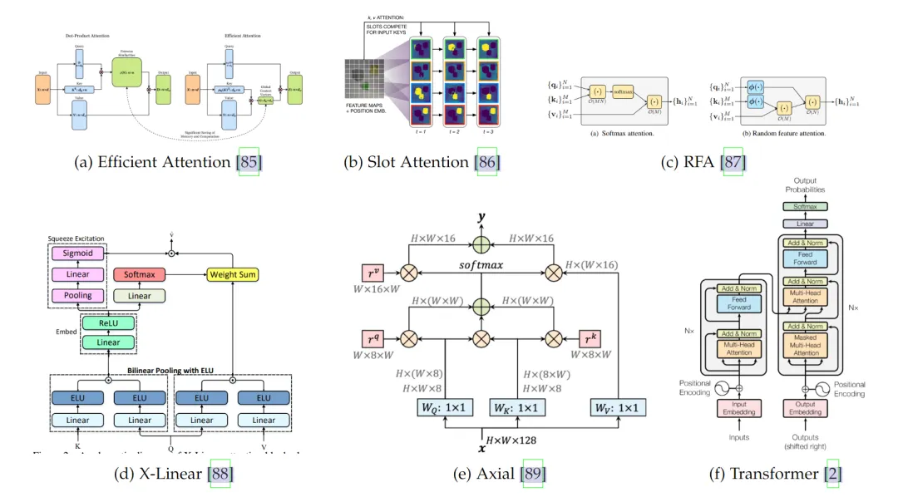

图 3 展示了自注意力方法的架构，包括 Transformers [2]、Axial Attention [89]、X-Linear [88]、Slot [86] 和 RFA [87]（图片来自相应文章）。

这些方法都属于自注意力，它们通过衡量相同输入的两张图之间的相似性来生成得分。然而，它们在处理方式上有所不同。

**软注意力是一种用来衡量数据重要性的机制**。想象一下，你在看一幅画，注意力帮助你决定该关注哪个部分。

在计算机中，软注意力通过一些数学函数来计算这个 “关注” 的程度，比如 SoftMax 或 Sigmoid（激活函数）。这是一种可以预测的方式，主要用在以下三种类型的注意力机制中：

- **通道注意力：**比如你在看一组不同颜色的滤镜，每个滤镜都强调图像的不同部分。通道注意力就像这样，**它根据每个特征通道（或滤镜）来计算得分。**这意味着模型在决定哪一部分重要时，会根据不同的特征图来做判断。
- **空间注意力：**这是**针对图像的具体区域进行关注，**而不是通道。想象你在地图上寻找热点地区，这就类似于空间注意力。它在目标检测、语义分割和人员重新识别等任务中非常有用。你可以单独使用，也可以与通道注意力结合使用，以更全面地处理信息。
- **自注意力：**这个机制会比较输入数据中不同部分之间的关联。就像你在分析一本书时，看看不同章节是如何联系在一起的。**自注意力根据输入数据中两个部分的相似度来计算得分。**与通道注意力不同，它的计算方式主要是比较两张图，而通道注意力是从单张图中生成分数。

软注意力的方法通常通过软函数（如 SoftMax 和 Sigmoid）来加权输入数据的不同部分。这种方式是可预测且可微的，这意味着可以通过反向传播进行训练。但它也有一些挑战，比如计算复杂度较高，可能会给一些不那么重要的部分分配权重。

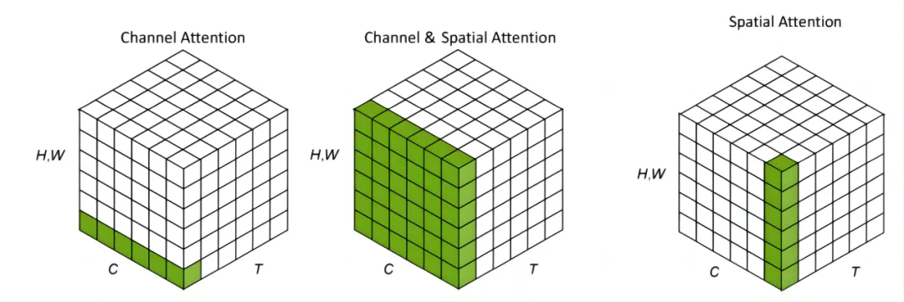

通道、空间和时序注意力可以看作是作用于不同域的机制。*C 代表通道域，H 和 W 代表空间域，T 则表示时间域*。

### 4.2 硬注意力（Hard Attention）

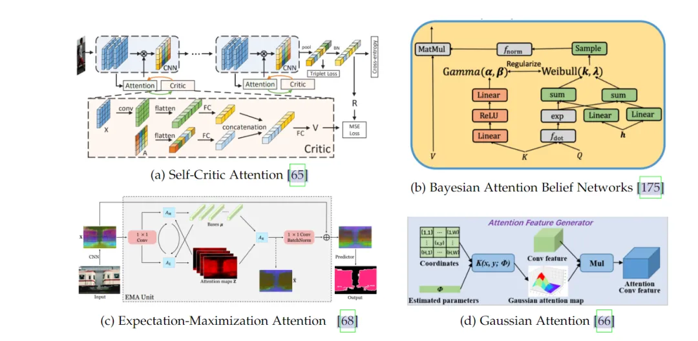

图 4 展示了硬注意力架构的示意图。包括 EMA [68]、Gaussian [66]、Self-critic [65] 和 Bayesian [175] 的构建模块。这些图像取自原始论文。

**硬注意力和软注意力的主要区别**在于硬注意力的随机性。硬注意力就像聚光灯，它只选择一个特定的区域来关注，而不是像软注意力那样平均分配注意力。硬注意力的主要类型包括：

- **贝叶斯注意力（Bayesian Attention）：**这种注意力使用贝叶斯统计模型来决定哪部分应该得到关注。就像你在做实验时，用概率来推断某个结果的可能性。贝叶斯注意力经常用于解决视觉问题，因为它可以帮助模型在不确定的情况下做出更好的决策。
- **强化学习注意力（Reinforced Attention）：**强化学习是一种基于奖励和惩罚的学习方式，就像训练宠物一样。当它做对了事情，你给它奖励，这就是强化学习。强化学习注意力利用这种方式来训练模型，帮助它选择最重要的部分。
- **高斯注意力（Gaussian Attention）：**高斯注意力使用一种叫做 2D 高斯核的数学工具来计算注意力得分。这个工具可以在视觉应用中很好地使用，因为它能够模拟现实世界中的光线分布，帮助模型更准确地识别图像中的重要部分。

### 4.3 多模态注意力（Multi-modal Attention）

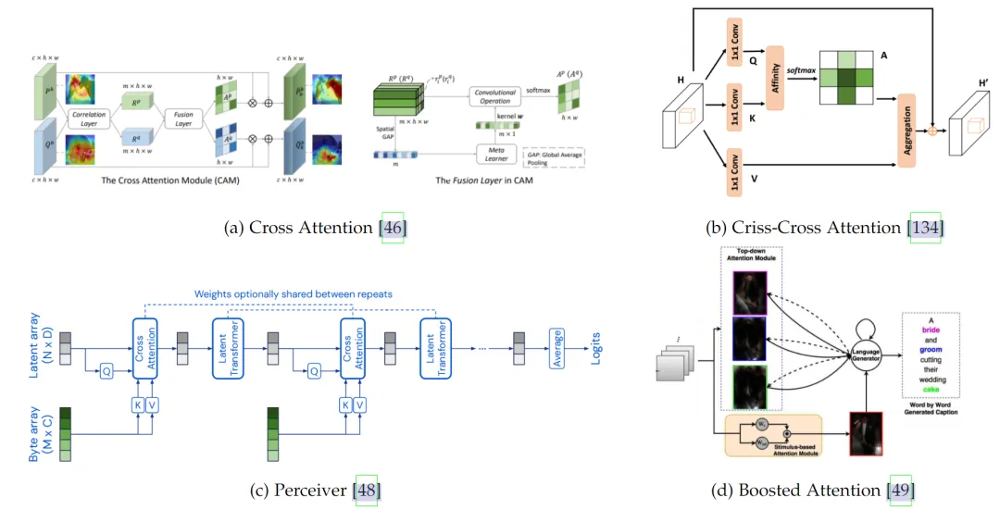

图 5 展示了多模态注意力方法，包括 Attention-based Perceiver [48]、Criss-Cross [46]、Boosted attention [49]、Cross-attention module [46]。这些方法使用多种模式来生成注意力得分。图像来自原始论文。

多模态注意力机制是一种用来处理多种不同类型数据的方法。比如：文本和图像。它的主要特点是能够在不同模式之间生成注意力，也就是让模型知道在一堆不同数据中关注哪些部分。它在许多场景中非常有用，尤其是当你同时处理多种数据时，比如在社交媒体分析或内容推荐中。

常见的多模态注意力机制包括：

- **交叉注意力（Cross Attention）：**这个机制通过比较不同模式之间的相关性来生成注意力得分。想象一下，你在看一幅图和一段文字，交叉注意力可以帮助模型找到图中的内容与文字之间的关联。它在许多应用中很有用，比如在多模态搜索和问答系统中。
- **Perceiver 模型：**这是一个基于 Transformer 的多模态模型，专门处理大规模、多模态数据。它可以同时处理不同类型的数据，如文本、图像和音频。这个模型非常强大，因为它能够应对各种复杂的任务，从语音识别到自然语言处理，再到计算机视觉。Perceiver 模型的灵活性使它适合用于许多需要处理多种数据类型的场景。

多模态注意力机制的好处是它可以让模型从不同角度理解数据，帮助模型更全面地做出决策。它在许多应用中非常有用，例如：语音识别、图像标注、自然语言处理、内容生成等。多模态注意力机制的关键是让模型在不同数据模式之间建立联系，从而更准确地完成任务。

### 4.4 算术注意力（Arithmetic Attention）

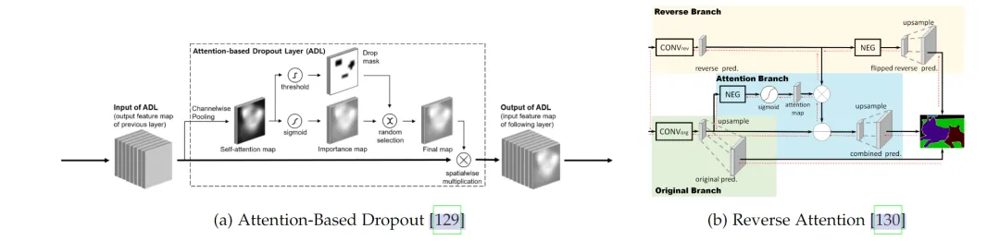

图 6 展示了基于算术的注意力方法。例如 Attention-based Dropout [129] 和 Reverse Attention [130]。这些图像来自原始论文。这些方法使用算术运算来生成注意力得分。例如取反、丢弃或倒数。

算术注意力是一种基于简单算术运算的方法，主要使用基本的数学操作来生成注意力得分。这种机制没有复杂的计算，它通过一些巧妙的算术方式来决定关注的焦点。常见的算术注意力包括：

- **反向注意力（Reverse Attention）：**这是通过取反来生成注意力得分。想象一下，模型通常会专注于某些特定的特征，而反向注意力则是反过来，关注那些通常被忽略的部分。这种机制有助于排除模型中不需要的特征，让模型专注于更重要的部分。
- **注意力 Dropout：**这是一种通过随机抛弃一些特征来改善模型鲁棒性的方法。就像你在整理房间时，有时候丢掉一些东西反而能让房间更整洁。注意力 Dropout 通过有意随机忽略一些特征，帮助模型更有效地训练，并减少过拟合的风险。它可以提高模型的稳定性和泛化能力，因为它可以让模型适应数据中的多样性，而不是过度依赖某些特征。

### 4.5 逻辑注意力（Logical Attention）

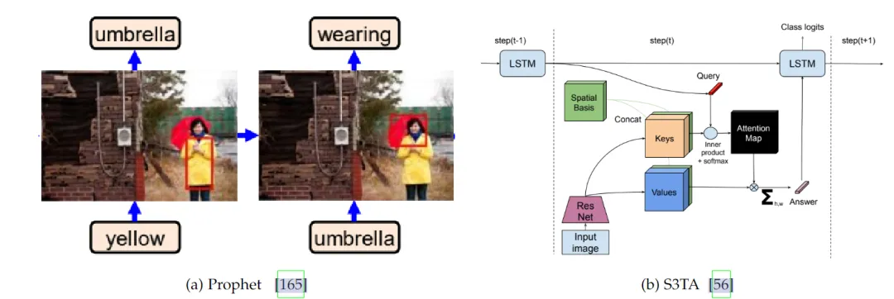

图 7 展示了基于逻辑的注意力方法的核心结构，例如 Prophet attention [165] 和 S3TA [56]。这些属于一种使用逻辑网络（如 RNN）来推断注意力得分的注意力类型。图像来自原始论文。

逻辑注意力机制是基于逻辑门的结构来计算注意力得分。逻辑门是一种数学结构，用来处理二进制数据。它像一个开关，根据不同的条件打开或关闭。逻辑注意力采用类似的概念，来决定哪些数据需要关注。常见的逻辑注意力包括：

- **递归注意力（Recurrent Attention）：**这种注意力使用递归神经网络（RNN）来生成注意力得分。递归神经网络可以处理序列数据，比如时间序列或文本。递归注意力能够记住之前的数据，然后根据这些记忆来决定新的注意力焦点。这在处理语音、文本或其他顺序数据时非常有用。
- **Show, Attend and Tell：**这是一个结合软注意力和硬注意力的模型，用于图像描述和语言生成。它的原理是：在处理图像时，模型首先使用软注意力来关注图像中的某些区域，然后使用硬注意力来生成描述。这种结合让模型既能灵活关注不同部分，又能根据需要进行精确的描述。它在图像标注、自动翻译和文本生成等领域非常受欢迎。

### 4.6 类别注意力（Category-Based Attention）

类别注意力是一种根据类别标签来生成注意力得分的机制。它可以引导模型关注某一特定类别的特征。在这个机制中，模型首先了解不同类别，然后根据这些类别的标签来决定该关注哪些数据。类别注意力的应用范围广泛，特别是在监督学习中。

想象一下，你在组织一组照片，每张照片都有一个标签，例如 “动物” 或 “植物”。类别注意力会根据这些标签来选择要关注的特征。如果是 “动物”，模型可能会关注爪子和毛皮；如果是 “植物”，可能会关注叶子和花朵。这种机制帮助模型在有明确标签的情况下更有效地进行学习。

类别注意力可以提高模型的准确性，因为它可以指导模型关注重要的特征，而忽略不相关的部分。然而，它也有一些限制，比如依赖于类别标签的质量。如果标签不准确，模型的注意力可能会偏离正确的方向。

---

这是各种注意力机制的详细分类和说明。每一种注意力机制都有其独特的应用场景和优缺点。

软注意力适合需要灵活关注的场景；而硬注意力适合需要精准聚焦的情况。

逻辑注意力与算术注意力可以用于处理复杂的逻辑关系，而多模态注意力可以处理多种数据类型。

每种注意力机制的选择取决于任务的需求和数据的特性。

从公式的角度来看，图像领域的注意力机制通常涉及加权的特征表示。注意力机制的关键在于计算注意力得分，然后根据这些得分来加权特征。这里有一些常见的公式和数学概念，用于解释图像领域的注意力机制。

## 5. 从公式的角度理解注意力机制

### 5.1 注意力得分计算

在自注意力机制中，常用的方法是计算查询（query）、键（key）、值（value）三者之间的关系。基本公式如下：

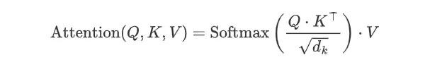

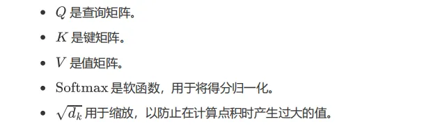

### 5.2 通道注意力

通道注意力通常通过全局平均池化或全局最大池化来计算每个通道的权重。一个典型的通道注意力机制的公式如下：

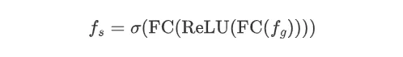

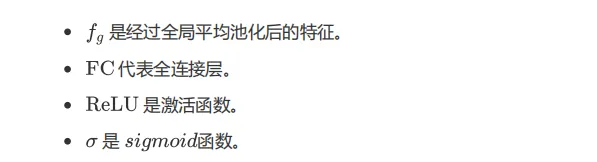

### 5.3 空间注意力

空间注意力着眼于特征图的空间维度，计算每个空间位置的重要性。一个典型的空间注意力机制的公式如下：

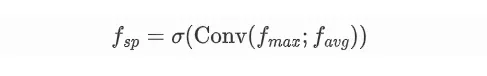

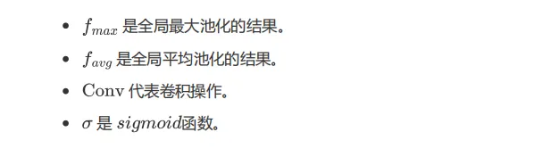

### 5.4 硬注意力

硬注意力通常涉及随机选择特定的状态作为注意力，而不是加权平均。这通常通过强化学习或贝叶斯模型来实现，公式的复杂性较高。

### 5.5 算术注意力

算术注意力通过简单的数学运算来生成注意力得分。例如，反向注意力通过取反来计算注意力得分：

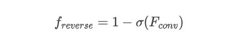

## 6. 总结

注意力机制的核心是计算注意力得分，然后根据这些得分来加权特征。

简单来说，这意味着模型会根据计算出的得分决定要重点关注哪些特征。这通常涉及一些数学概念，比如矩阵运算、卷积操作、激活函数、池化操作等。

在注意力机制中，计算注意力得分是关键的一步。得分越高，模型就越关注对应的特征。这些操作可能涉及复杂的矩阵运算和其他数学计算。然后模型会根据这些得分来调整对输入数据的关注程度。

在实际应用中，这些公式可能会有所变化，具体取决于注意力机制的类型和应用场景。无论是处理文本、图像还是音频，注意力机制都可以帮助模型更好地选择要关注的内容，从而提高处理数据的效率和准确性。