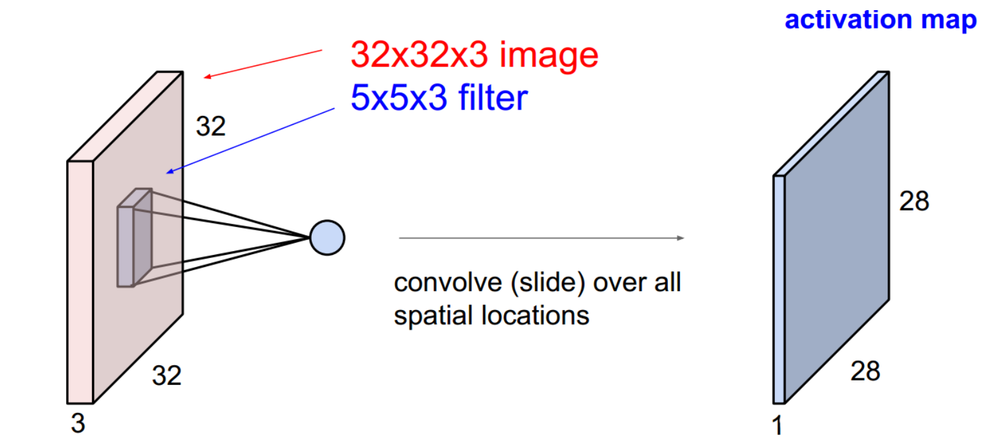
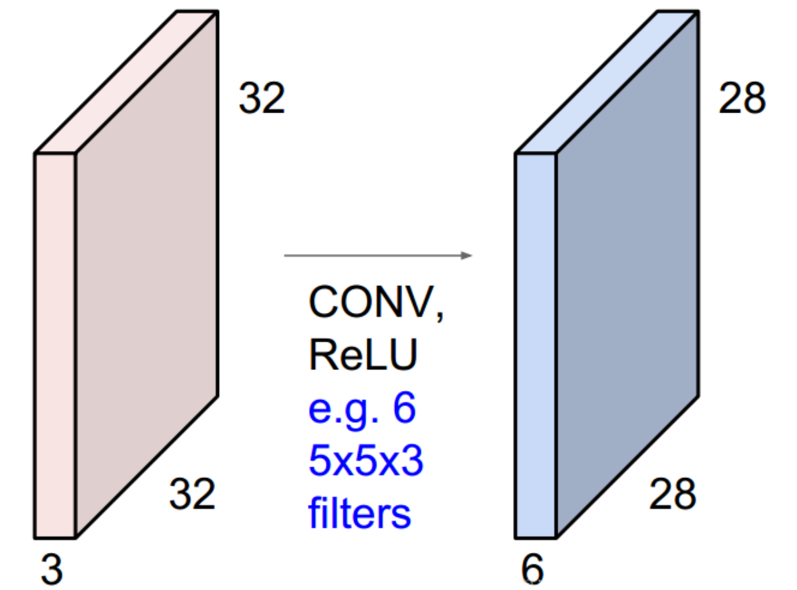
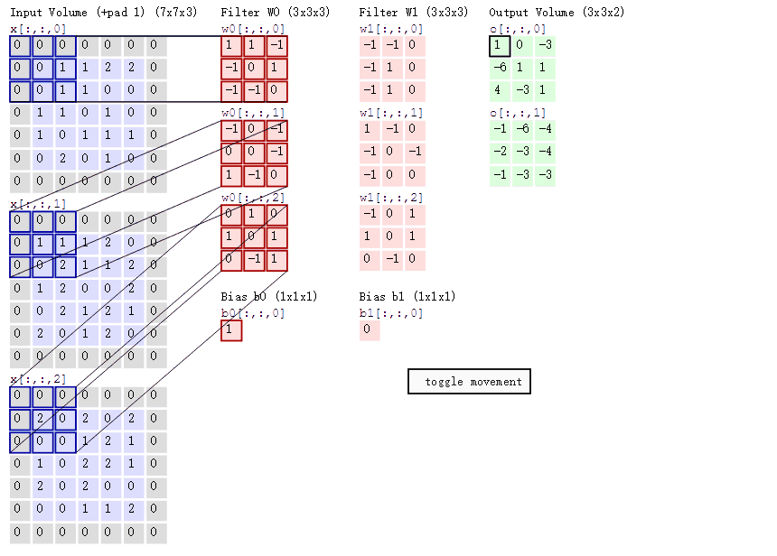
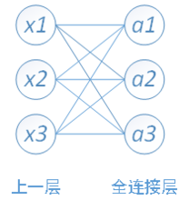

$O(c_{in} c_{out} k_h k_w m_h m_w)$

[toc]

# 参数量、计算量

为什么要计算模型的参数量和计算量？

- 好的网络模型不仅要求精度准，还要求模型的参数量和计算量不大，才能有利于部署。
- 模型的参数量和计算量可以用于不同网络模型之间的对比分析。
- 有的模型虽然参数量相同，但是可能因为连接方式和结构等不同而导致计算量不同。

计算量与参数量的对比

- 计算量是指：网络模型需要计算的*运算次数*，参数量是指：网络模型自带的*参数数量*多少。
- 计算量对应*时间复杂度*，参数量对应于*空间复杂度*。
- 计算量决定了网络*执行时间*的长短，参数量决定了*占用显存*的大小。

## 1. 参数量（Parameters, Weights）

**参数量**是模型中的参数的总和，跟模型在磁盘中所需的空间大小直接相关。

对于 CNN 来说，参数主要由卷积层或全连接层（Conv / FC 层）的权重（Weight）构成。当然其他的一些算子也有参数，不过一般忽略不计。

参数量往往是被算作访存量（MAC）的一部分。因此参数量不直接影响模型推理性能，但是参数量一方面会影响内存占用，另一方面也会影响程序初始化的时间。

参数量会直接影响软件包的大小。当软件包大小是很重要的指标时，参数量至关重要，例如手机 APP 场景，往往对 APK 包的大小有比较严格的限制；此外有些嵌入式设备的 Flash 空间很小，如果模型磁盘所需空间很大的话，可能会放不下，因此也会对参数量有所要求。

除了在设计模型时减少参数量外，还可以通过压缩模型的方式降低软件包大小。例如 Caffe 和 ONNX 采用的 Protobuf 就会对模型进行高效的编码压缩。不过压缩模型会带来解压缩开销，会一定程度增加程序初始化的时间。

## 2. 计算量（FLOPs）

**计算量**是模型所需的计算次数，反映了模型对硬件计算单元的需求。

计算量一般用 OPs (Operations) ，即计算次数来表示。由于最常用的数据格式为 float32，因此也常常被写作 FLOPs (Floating Point Operations)，即浮点计算次数。

模型的整体计算量等于模型中每个算子的计算量之和。而每个算子的计算量计算方法各不一致。例如对于 `Elementwise Sum`，两个大小均为 $(N, C, H, W)$ 的 Tensor 相加，计算量为 $N ∗ C ∗ H ∗ W$。

对于计算量主要有 MAdds 和 MFlops 两个概念。ShuffleNet 论文用的是 MFlops，MobileNet 用的是 MAdds。MAdds 是 MFlops 的两倍。

### 2.1. 乘加累积操作（MACs, MAdds）

$MACs=MAdds=2*FLOPs$

乘加累积操作（Multiply-Accumulate Operations, MACs），MACs 和 MAdds 是同一个概念。MACs 常常与 FLOPs 概念混淆，实际上 1MACs 包含一个乘法操作和一个加法操作， 1MACs 等于 2 倍 FLOPs。

### 2.2 FLOPs 与 FLOPS

**FLOPS：**注意全大写，是 floating point operations per second 的缩写，意指每秒浮点运算次数，理解为计算速度。是一个衡量硬件性能的指标。

**FLOPs：**注意 s 小写，是 floating point operations 的缩写（s 表复数），意指浮点运算数，理解为计算量。可以用来衡量算法 / 模型的复杂度。

## 3. 访存量(MAC)

访存量（memory access cost, MAC），又称为内存访问量，是指模型运行时所需访问存储单元的字节大小，反映了模型对存储单元带宽的需求。访存量一般用 Bytes（或者 KB/MB/GB）来表示，即模型计算到底需要存/取多少 Bytes 的数据。

和计算量一样，模型整体 MAC 等于模型各个算子的访存量之和。对于 Elementwise Sum 来讲，两个大小均为 $(N, C, H, W)$ 的 Tensor 相加，MAC 为 $( 2 + 1 ) ∗ N ∗ C ∗ H ∗ W ∗ sizeof(data\_type)$ ，其中 2 代表读两个 Tensor，1 代表写一个 Tensor。

## 4. 内存占用

内存占用是指模型运行时所占用的内存 / 显存大小。一般有工程意义的是最大内存占用，当然有的场景下会使用平均内存占用。

这里要注意的是，内存占用 ≠ 访存量。 内存占用在论文里不常用，主要原因是其大小除了受模型本身影响外，还受软件实现的影响。

例如有的框架为了保证推理速度，会将模型中每一个 Tensor 所需的内存都提前分配好，因此内存占用为网络所有 Tensor 大小的总和；但更多的框架会提供 lite 内存模式，即动态为 Tensor 分配内存，以最大程度节省内存占用（当然可能会牺牲一部分性能）。

# 通俗理解参数量的计算

下图中，输入特征图尺寸为 $32 \times 32 \times 3$，用一个  $5 \times 5 \times 3$ 的卷积核对其中某个位置的计算。这里计算的是一个点积，所以输出是一个单独的标量值。

因为卷积的操作是通过一个滑动窗口实现的，通过卷积操作，输出特征图尺寸为 $28 \times 28 \times 1$。如果有 6 个 Filter，输出特征图尺寸为 $28 \times 28 \times 6$。

这里用到的参数量只需要把每个 Filter 的参数累加起来，同时加上 bias 偏置：$5 \times 5 \times 3 \times 6 + 6 = 456$。

# 参数量、计算量的数学表达

如图所示，该图有两个卷积核，分别为 Filter W0 和 Filter W1。输入通道数 $C_i$ 为 3，输出通道数 $C_o$ 为 2，输出通道数和卷积核个数是相等的，也等于偏置的个数。

其中，Output Volume 中的 $o[:, :, 0]$ 的输出结果 1 的计算方法为图中 Filter W0 各通道与输入相应的通道位置做乘积后再相加。
$$
\begin{aligned}
o[0, 0, 0] & =  0 * 1+ 0 * 1 + 0 * -1 + 0 * -1 + 0 * 0 + 1 * 1 + 0 * -1 + 0 * -1 + 1 * 0 \\
& + -1 * 0 + 0 * 0 + -1 * 0 + 0 * 0 +0 * 1 + -1 * 1 + 1 * 0 + 0 * 0 + 0 * 2 \\
& + 0 * 0 + 1 * 0 + 0 * 0 + 1 * 0 + 0 * 2 + 1 * 0 + 0 * 0 + -1 * 0 + 1 * 0 \\
& = 1
\end{aligned}
$$

## 普通卷积的参数量（parameters）和计算量（FLOPs）

**对于 CNN 而言，每个卷积层的参数量计算：**$params = C_o \times (k_w \times k_h \times C_i + 1)$

- $C_o$ 表示输出通道数，$C_i$ 表示输入通道数。
- $k_w$ 和 $k_h$ 表示卷积核的宽和高。
- $k_w \times k_h \times C_i$ 表示一个卷积核的权重数量，$+1$ 表示 bias。
- $(k_w \times k_h \times C_i + 1)$ 表示一个卷积核的参数量。
- $C_o$ 表示该层有 $C_o$ 个卷积核。

若卷积核是方形的，即 $k_w=k_h=k$，则上式变为：$params = C_o \times (k \times k \times C_i + 1)$

若使用 Batch Normalization 时，则不需要 bias，此时计算式中的 $+1$ 项去除。

**对于 CNN 而言，每个卷积层的运算量计算：**$FLOPs = [(C_i \times k_w \times k_h) + (C_i \times k_w \times k_h - 1) + 1] \times C_o \times W \times H$

- $[(C_i \times k_w \times k_h) + (C_i \times k_w \times k_h - 1) + 1]$ 表示卷积操作计算出 Feature Map 中一个点所需要的运算量（乘法和加法）。
- $C_i \times k_w \times k_h$ 表示一次卷积操作中的乘法运算量。
- $C_i \times k_w \times k_h - 1$ 表示一次卷积操作中的加法运算量。$+1$ 表示 bias。
- $W$ 和 $H$ 分别表示 Feature Map 的长和宽。
- $C_o \times W \times H$ 表示 Feature Map 的所有元素数。

若卷积核是方形的，即 $k_w=k_h=k$，则上式变为：$FLOPs = 2 \times C_i \times k \times k \times C_o \times W \times H$

上面是乘运算和加法运算的总和，将一次乘运算或加运算都视作一次浮点运算。在计算机视觉论文中，常常将一个 “乘-加” 组合视为一次浮点运算，英文表述为  “Multi-Add”，运算量正好是上面的算法减半，此时的运算量为：$FLOPs = C_i \times k \times k \times C_o \times W \times H$

## 全连接层的参数量（parameters）和计算量（FLOPs）

全连接层的每一个结点都与上一层的所有结点相连，用来把前边提取到的特征综合起来。由于其全相连的特性，一般全连接层的参数也是最多的。

其中，$x1、x2、x3$ 为全连接层的输入，$a1、a2、a3$ 为输出。
$$
\begin{flalign}
a_1 = W_1^1x_1 + W_1^2x_2 + W_1^3x_3 + b_1 \\
a_2 = W_2^1x_1 + W_2^2x_2 + W_2^3x_3 + b_2 \\
a_2 = W_3^1x_1 + W_3^2x_2 + W_3^3x_3 + b_3
\end{flalign}
$$
**对全连接层而言，其参数量计算：**$params = (I + 1) \times O = I \times O + O$ 

每一个输出神经元连接着所有输入神经元，所以有 $I$ 个权重，每个输出神经元还要加一个 bias。

**对全连接层而言，其运算量计算：**$FLOPs = [I + (I - 1) + 1] \times O = 2 \times I \times O$

- $[I + (I - 1) + 1]$ 表示一个神经元所需的运算量。
- $I$ 表示乘法运算量，$I-1$ 表示加法运算量，$+1$ 表示 bias。
- $O$ 表示计算 $O$ 个神经元的值。