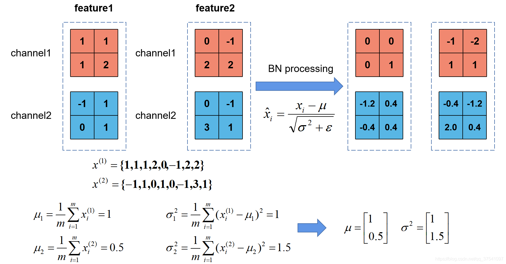
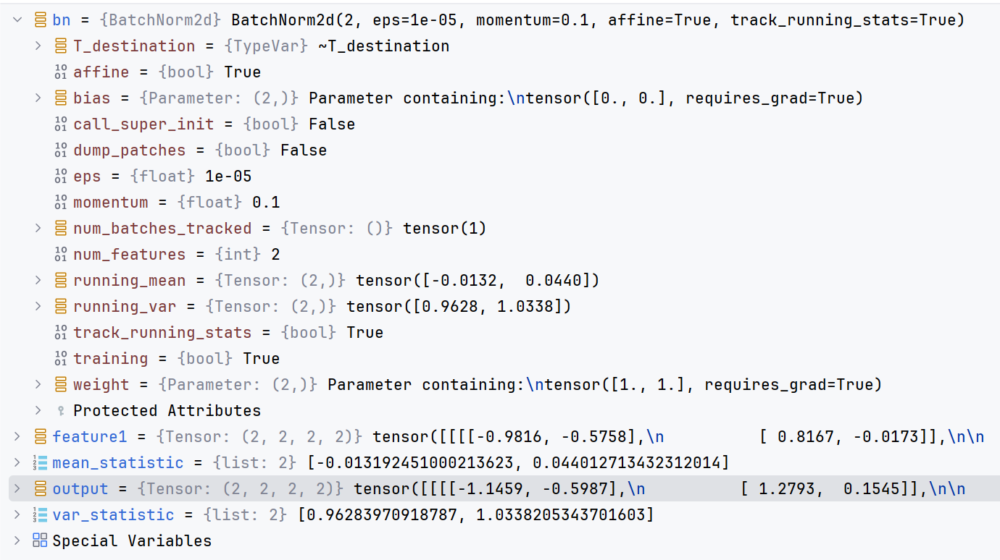
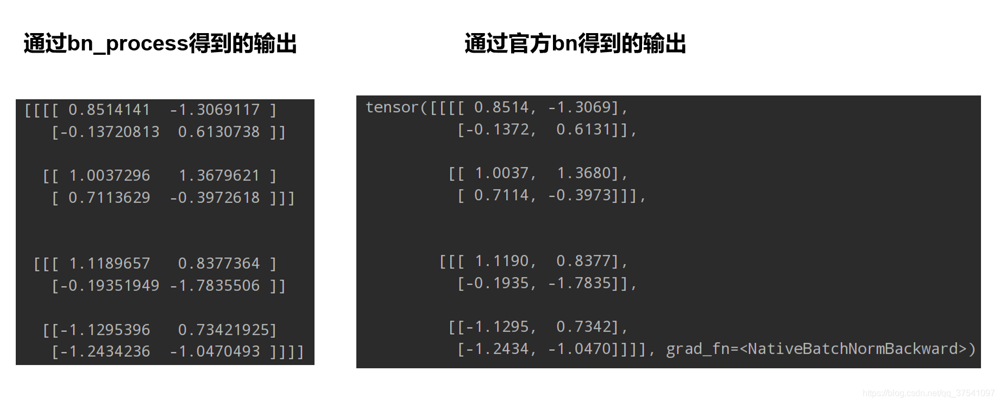

[toc]

# Batch Normalization

Batch Normalization 是 Google 团队在 2015 年论文《Batch Normalization: Accelerating Deep Network Training by Reducing Internal Covariate Shift》提出的。通过该方法能够加速网络的收敛并提升准确率。

## 1. Batch Normalization 原理

通常在图像预处理过程中，会对图像进行标准化处理，这样能够加速网络的收敛。

如下图所示。对于 Conv1 来说，输入的就是满足某一分布的特征矩阵，但对于 Conv2 而言，输入的 Feature Map 就不一定满足某一分布规律了（注意，**这里所说的 “满足某一分布规律” 并不是指某一个 Feature Map 的数据要满足分布规律，理论上是指整个训练样本集所对应 Feature Map 的数据要满足分布规律**）。

而 Batch Normalization 的目的就是 Feature Map 满足均值为 0，方差为 1 的分布规律。


下面是从原论文中截取的原话，注意标黄的部分：


<center>“对于一个拥有 d 维的输入 x，我们将对它的每一个维度进行标准化处理。”</center>

假设输入 $\mathbf{x}$ 是 RGB 三通道的彩色图像，那么这里的 $d$ 就是输入图像的 Channels。即 $d=3$，$\mathbf{x} = (x^{(1)}, x^{(2)}, x^{(3)})$。其中 $x^{(1)}$ 代表 R 通道所对应的特征矩阵，依此类推。

标准化处理也就是***分别***对 R 通道，G 通道，B 通道进行处理。上面的公式不用看，原文提供了更加详细的计算公式：


上文说，***让 Feature Map 满足某一分布规律，理论上是指整个训练样本集所对应 Feature Map 的数据要满足分布规律***。

也就是说要计算出整个训练集的 Feature Map，然后再进行标准化处理。对于一个大型的数据集明显是不可能的，所以论文中说的是 Batch Normalization，也就是我们计算一个 Batch 数据的 Feature Map 然后再进行标准化（Batch 越大越接近整个数据集的分布，效果越好）。

我们根据上图的公式可以知道：

$\mu_{\mathcal{B}}$ 代表着我们计算的 Feature Map 的每个维度（Channel）的均值（***注意 $\mu_{\mathcal{B}}$ 是一个向量，而不是一个值，$\mu_{\mathcal{B}}$ 向量的每一个元素代表着一个维度（Channel）的均值***）。

$\sigma_{\mathcal{B}}^2$ 代表着我们计算的 Feature Map 每个维度（Channel）的方差（***注意 $\sigma_{\mathcal{B}}^2$ 是一个向量，而不是一个值，$\sigma_{\mathcal{B}}^2$ 向量的每一个元素代表着一个维度（Channel）的方差***）。

然后根据 $\mu_{\mathcal{B}}$ 和 $\sigma_{\mathcal{B}}^2$ 计算标准化处理后得到的值。下图给出了一个计算均值和方差的示例：



上图展示了一个 Batch Size 为 2（两张图片）的 Batch Normalization 的计算过程。

假设 feature1、feature2 分别是由 image1、image2 经过一系列卷积池化后得到的特征矩阵。feature 的 channel 为 2，那么 $x^{(1)}$ 代表该 Batch 的所有 feature 的 channel1 的数据，同理 $x^{(2)}$ 代表该 Batch 的所有 feature 的 channel2 的数据。

然后分别计算 $x^{(1)}$ 和 $x^{(2)}$ 的均值与方差，得到我们的 $\mu_{\mathcal{B}}$ 和 $\sigma_{\mathcal{B}}^2$ 两个向量。

然后再根据标准差计算公式***分别***计算每个 channel 的值（公式中 $\varepsilon$ 的是一个很小的常量，防止分母为零的情况）。

在我们训练网络的过程中，我们是通过一个 Batch 一个 Batch 的数据进行训练的，但是我们在预测过程中通常都是输入一张图片进行预测，此时 Batch Size 为 1。如果再通过上述方法计算均值和方差就没有意义了。

所以我们在训练过程中要去不断的计算每个 Batch 的均值和方差，并使用移动平均（Moving Average）的方法记录统计的均值和方差，在训练完后我们可以近似认为所统计的均值和方差就等于整个训练集的均值和方差。***然后在我们验证以及预测过程中，就使用统计得到的均值和方差进行标准化处理。***

细心阅读会发现，在原论文公式中不是还有 $\gamma$，$\beta$ 两个参数吗？

是的，$\gamma$ 是用来调整数值分布的方差大小，$\beta$ 是用来调节数值均值的位置。这两个参数是在反向传播过程中学习得到的，$\gamma$ 的默认值是 1，$\beta$ 的默认值是 0。

## 2.  PyTorch 实现 Batch Normalization

你以为你都懂了？不一定哦。

刚刚说了，在我们**训练过程中**，均值 $\mu_{\mathcal{B}}$ 和方差 $\sigma_{\mathcal{B}}^2$ 是通过计算当前批次数据得到的。记为：$\mu_{now}$ 和 $\sigma_{now}^2$。

而我们的**验证以及预测过程中**，所使用的均值、方差是一个统计量。记为 $\mu_{statistic}$ 和 $\sigma_{statistic}^2$。$\mu_{statistic}$ 和 $\sigma_{statistic}^2$ 的具体更新策略如下。其中 $momentum$ 默认取 0.1：
$$
\mu_{statistic + 1} = (1 - momentum) * \mu_{statistic} + momentum * \mu_{now} \\
\sigma_{statistic + 1}^2 = (1 - momentum) * \sigma_{statistic}^2 + momentum * \sigma_{now}^2
$$
**这里要注意一下**，在 PyTorch 中对当前批次 feature 进行 BN 处理时所使用的 $\sigma_{now}^2$ 是**总体标准差**，计算公式如下：
$$
\sigma _{now}^{2} = \frac{1}{m} \sum_{i=1}^{m} (x_{i} - \mu_{now})^2
$$
在更新统计量 $\sigma_{statistic}^2$ 时采用的 $\sigma_{now}^2$ 是**样本标准差**，计算公式如下：
$$
\sigma _{now}^{2} = \frac{1}{m-1} \sum_{i=1}^{m} (x_{i} - \mu_{now})^2
$$

### 使用 PyTorch 验证

1. `bn_process` 函数是自定义的 BN 处理方法，用于验证是否和使用官方 BN 处理方法结果一致。
	在 `bn_process` 中计算输入 Batch 数据的每个维度（这里的维度是 Channel 维度）的均值和标准差（标准差等于方差开平方），然后通过计算得到的均值和**总体标准差**对 feature 每个维度进行标准化，然后使用均值和**样本标准差**更新统计均值和标准差。
2. 初始化统计均值是一个元素为 0 的向量，元素个数等于 Channel 深度。
	初始化统计方差是一个元素为 1 的向量，元素个数等于 Channel 深度。
	初始化 $\gamma$ = 1，$\beta$ = 0。

```python
import numpy as np
import torch
from torch import nn


def bn_process(feature, mean, var):
    """验证和官方 BN 处理方法结果是否一致

    Args:
        features: 特征图
        mean: 均值
        var: 方差

    Returns:

    """
    feature_shape = feature.shape
    for i in range(feature_shape[1])    # channel
        # [batch, channel, height, width]
        feature_t = feature[:, i, :, :]  # 取出 Channe_i 的特征图
        # 均值
        mean_t = feature_t.mean()
        # 总体标准差
        std_t = feature_t.std()
        # 样本标准差
        std_s = feature_t.std(ddof=1)

        # bn process
        # 这里记得加上 epsilon: 1e-5(0.00001) 和 PyTorch 保持一致
        feature[:, i, :, :] = (feature[:, i, :, :] - mean_t) / np.sqrt(std_s ** 2 + 1e-5)

        # update calculating mean and var
        mean[i] = mean[i] * 0.9 + mean_t * 0.1
        var[i] = var[i] * 0.9 + (std_s ** 2) * 0.1
    print(feature)


# 随机生成一个 Batch 为 2，Channel 为 2，Height = Width = 2 的特征向量
# [batch, channel, height, width]
feature1 = torch.randn(2, 2, 2, 2)

# 初始化统计均值和方差
mean_statistic = [0.0, 0.0]
var_statistic = [1.0, 1.0]
# print(feature1.numpy())

# 注意要使用 copy() 深拷贝
bn_process(feature1.numpy().copy(), mean_statistic, var_statistic)

bn = nn.BatchNorm2d(2, eps=1e-5)
output = bn(feature1)
print(output)

```

首先在最后设置了一个断点进行调试，查看下官方 BN 对 feature 处理后得到的统计均值和方差。

我们可以发现，官方提供的 BN 的 running_mean 和 running_var 和我们自己计算的 mean_statistic 和 var_statistic 是一模一样的（只是精度不同）。



然后我们打印出通过自定义 bn_process 函数得到的输出以及使用官方 BN 处理得到输出，明显结果是一样的（只是精度不同）：



## 3. 使用 BN 时的注意事项

- 训练时要将 `traning` 参数设置为 `True`，在验证时将 `trainning` 参数设置为 `False`。在 PyTorch 中可通过创建模型的 `model.train()` 和 `model.eval()` 方法控制。
- Batch Size 尽可能设置大点。设置小后表现可能很糟糕，设置的越大，求的均值和方差越接近整个训练集的均值和方差。
- 建议将 BN 层放在卷积层（Conv）和激活层（例如 ReLU）之间，且卷积层不要使用偏置 `bias`，因为没有用，参考下图推理，即使使用了偏置 `bias` 求出的结果也是一样的。

