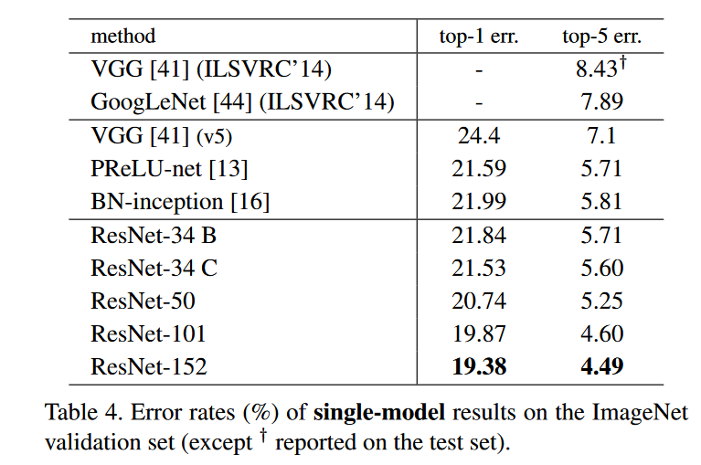

[toc]

# 模型评估指标

在论文中，通常会使用 top-1 和 top-5 准确率或错误率来表示模型的性能好坏。

## top-1 和 top-5

我们在训练完某个分类网络后，假设我们需要分类的数量为 50 类，我们需要评估它的分类性能。输入测试集的每张图片，会得到它的 50 个类别的的概率。

top-5 准确率就是：在这张测试的图片 50 的类别中，取出概率最大的前 5 个类别，如果真实类别在这  5 个类别中，则预测正确，否则预测错误，再测完全部测试集。
$$
top-5_{accurary} = \frac{真实类别在预测的五个类别中的数量} {所有测试集的数量}
$$
同理：top-1 准确率就是平常我们评估预测的准确性指标。
$$
top-1_{Accuracy} = \frac{预测正确的数量}{所有测试集的数量}
$$
而 top-5 错误率与 top-1 错误率恰好与 top-5 准确率和 top-1 准确率相反，他们的和为 1。